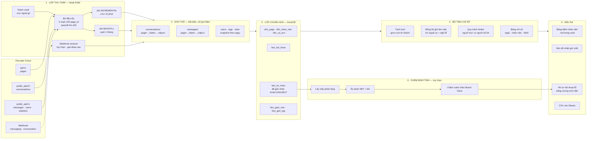
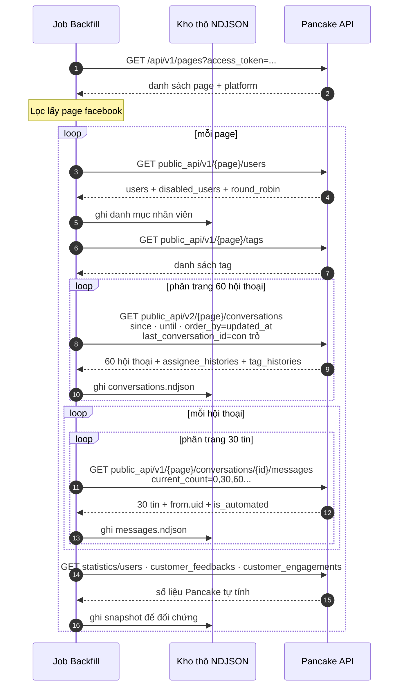
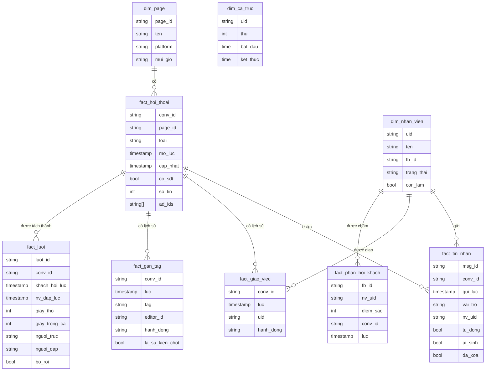
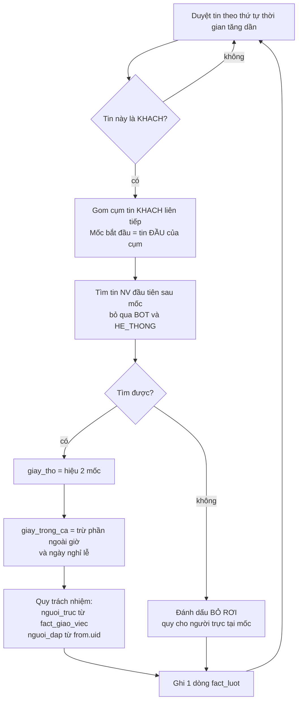
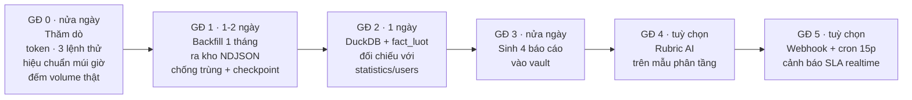

# Kiến Trúc — Kéo Toàn Bộ Hội Thoại Facebook Từ Pancake Về Và Chấm Hiệu Quả CSKH

> [!warning] Đây là bản thiết kế, chưa code
> Đọc mục **11. Những thứ cần chốt** ở cuối trước khi duyệt. Có 6 quyết định thay đổi hẳn cách dựng hệ thống.

---

## 1. Tôi đã đọc được gì trong API Pancake

Trang `developer.pancake.biz` là giao diện Stoplight, nội dung thật nằm ở hai file OpenAPI: `/openapi/openapi.yaml` (36 endpoint) và `/openapi/webhook.yaml` (5 loại sự kiện). Dưới đây là phần liên quan tới bài toán này.

### 1.1 Xác thực — chỉ có 2 loại token, đều truyền qua query string

Không có header `Authorization`. Mọi thứ nhét vào URL.

| Token | Tham số | Dùng cho | Hạn |
|---|---|---|---|
| User Access Token | `access_token` | `https://pages.fm/api/v1/...` — liệt kê page, sinh page token | tối đa **90 ngày**, mất khi logout |
| Page Access Token | `page_access_token` | `https://pages.fm/api/public_api/v1/` và `/v2/` — hội thoại, tin nhắn, thống kê, khách | **không hết hạn** tới khi xoá/tạo lại |

Lấy tay: User token ở **Tài khoản → Cài đặt cá nhân**. Page token ở **Cài đặt page → Công cụ**.
Lấy bằng API: `POST /pages/{page_id}/generate_page_access_token?access_token=...` (phải là admin page — **lưu ý: gọi cái này sẽ vô hiệu hoá token cũ**, đừng chạy bừa nếu đang có tool khác dùng).

### 1.2 Ba máy chủ khác nhau — nhớ kỹ vì rất dễ gọi nhầm

| Base URL | Dùng cho |
|---|---|
| `https://pages.fm/api/v1` | `/pages`, `/pages/{id}/generate_page_access_token` |
| `https://pages.fm/api/public_api/v1` | **messages**, mọi `statistics/*`, `users`, `tags`, `posts`, `page_customers`, `sip_call_logs` |
| `https://pages.fm/api/public_api/v2` | **conversations** (chỉ mỗi cái này ở v2) |

### 1.3 Giới hạn tần suất

**5 request / giây / page.** Tính riêng theo `page_id`, nên nhiều page thì chạy song song được. Quá thì trả `429`.

### 1.4 Bốn endpoint là xương sống của hệ thống này

**a) Danh sách hội thoại** — `GET /api/public_api/v2/pages/{page_id}/conversations`
- Trả **60 hội thoại/lần**, phân trang bằng `last_conversation_id` (con trỏ, không phải offset).
- Lọc: `since` / `until` (Unix giây), `type` (`INBOX`, `COMMENT`, `COMMENT_LIVESTREAM`, `POST`), `tags`, `post_ids`, `order_by` (`inserted_at` | `updated_at`).
- Mỗi hội thoại trả về **nguyên khối vàng** cho bài toán chấm nhân viên:
  - `assignee_ids`, `current_assign_users` — ai đang phụ trách
  - `assignee_histories[]` — **nhật ký giao việc có mốc thời gian** (`inserted_at`, `added_users`, `deleted_users`)
  - `tag_histories[]` — nhật ký gắn/gỡ tag kèm `editor_id`, `editor_name`
  - `last_sent_by` — kèm `uid`, `admin_id`, `admin_name`, `ai_generated`, `is_automated`
  - `has_phone`, `recent_phone_numbers[]` (có cả `order_id`)
  - `message_count`, `inserted_at`, `updated_at`, `ad_ids`

**b) Tin nhắn trong hội thoại** — `GET /api/public_api/v1/pages/{page_id}/conversations/{conversation_id}/messages`
- Trả **30 tin/lần**, mới nhất trước, phân trang bằng `current_count` (chỉ số vị trí).
- Mỗi tin có: `inserted_at`, `from.id`, `from.name`, **`from.uid`** (UUID nhân viên Pancake), **`from.admin_id`**, `from.admin_name`, **`from.ai_generated`**, **`from.is_automated`**, `has_phone`, `is_removed`, `is_hidden`, `attachments[]`.
- Ba trường in đậm là **chìa khoá của toàn bộ bài toán**: chúng cho phép tách "người thật trả lời" khỏi "bot trả lời tự động". Không có chúng thì mọi con số SLA đều rác, vì chatbot trả lời trong 2 giây sẽ khiến nhân viên nào cũng đẹp.

**c) Danh sách nhân viên** — `GET /api/public_api/v1/pages/{page_id}/users`
- `users[]` (id UUID, name, fb_id, `status`, `status_in_page`, `is_online`, `page_permissions`), `disabled_users[]`, và `round_robin_users` tách riêng `inbox` / `comment`.
- Đây là bảng danh mục nhân viên. Bắt buộc phải kéo, nếu không thì báo cáo chỉ có UUID.

**d) Thống kê sẵn có của Pancake** — dùng để **đối chứng**, không dùng làm nguồn chính
- `statistics/users` — `average_response_time` (mili-giây), `inbox_count`, `comment_count`, `unique_inbox_count`, `phone_number_count`, `private_reply_count`, chia theo **từng giờ**. Tham số `date_range` dạng `DD/MM/YYYY HH:MM:SS - DD/MM/YYYY HH:MM:SS`, **giờ địa phương của page**.
- `statistics/customer_feedbacks` — điểm sao khách chấm, có `admin_id`, `rate`, `message`, và bảng `customer_average_feedback` (avg theo từng nhân viên). Khoảng thời gian tối đa **1 tháng**.
- `statistics/customer_engagements` — `users_engagements[]` có `inbox_count`, `order_count`, `old_order_count`, `total_engagement` theo nhân viên.

> **Vì sao không lấy thẳng `statistics/users` cho xong?** Vì nó chỉ cho **trung bình**. Trung bình che mọi thứ: một nhân viên trả lời 90% trong 1 phút và 10% sau 3 tiếng sẽ có "trung bình 20 phút" — nhìn thì tệ, thực tế lại tốt. Bạn hỏi "**trong 5 phút đã trả lời hay chưa**" — đó là câu hỏi về **tỷ lệ phần trăm số lượt**, Pancake không trả lời được. Phải tự tính từ tin nhắn thô.

### 1.5 Webhook — có, nhưng không giải quyết được việc lấy dữ liệu quá khứ

5 sự kiện: `messaging`, `conversation`, `subscription`, `post`, `connect_status`.
- Phải **liên hệ support Pancake để bật**, và **mỗi page bật webhook ăn thêm 1 slot kết nối** trong gói thuê bao.
- Payload `messaging` trả nguyên `conversation` + `message` + `post`.
- Webhook bị **tự động treo** nếu trong 30 phút mà tỷ lệ lỗi >80% **và** số request lỗi ≥300. Treo rồi phải vào UI bật lại tay.
- `inserted_at` trong webhook ghi rõ là **UTC** — trong khi `statistics/*` lại dùng giờ page. Đây là bẫy, xử lý ở mục 8.

**Kết luận:** webhook chỉ có dữ liệu **từ lúc bật trở đi**. Tháng gần nhất mà bạn muốn phân tích **bắt buộc phải backfill qua REST**. Webhook là thứ làm sau, cho giai đoạn cảnh báo thời gian thực.

---

## 2. Kiến trúc tổng thể

### Vì sao chia 5 lớp mà không viết một script chạy thẳng ra báo cáo

1. **Kho thô bất biến** — kéo 1 tháng dữ liệu mất công và tốn quota. Khi bạn đổi định nghĩa "thế nào là trả lời chậm" (và bạn **sẽ** đổi, ít nhất 3 lần), chỉ cần chạy lại lớp 4 trong vài giây, không phải gọi lại Pancake.
2. **Kiểm chứng được** — mọi con số trong báo cáo truy ngược được về đúng `message.id` trong file NDJSON. Khi nhân viên cãi "em có trả lời mà", bạn mở ra được bằng chứng. Cãi nhau về KPI mà không có nguồn thì hệ thống chết sau 2 tuần.
3. **Chạy lại được** — job hỏng giữa chừng thì chạy tiếp từ con trỏ, không mất gì.

---

## 3. Luồng thu thập dữ liệu

### Ước lượng thời gian chạy

Số lệnh gọi ≈ `số_hội_thoại / 60` (lấy danh sách) + `Σ ceil(số_tin / 30)` (lấy tin nhắn).

Ví dụ 1 page, 3.000 hội thoại có hoạt động trong tháng, trung bình 25 tin/hội thoại:
`3000/60 + 3000×1 ≈ 3.050 lệnh` ÷ 5 lệnh/giây ≈ **10 phút**.

Ba page chạy song song vẫn ~10 phút vì giới hạn tính riêng theo page. Với hội thoại comment livestream (rất nhiều thread ngắn), số hội thoại có thể gấp 5–10 lần → **đo trước ở Giai đoạn 0 rồi mới quyết định có gộp comment vào hay không**.

### Quy tắc bắt buộc trong lớp thu thập

- **Điều tốc theo `page_id`** — token bucket 5/giây riêng cho từng page, không phải cho cả tiến trình.
- **Gặp `429`** → lùi luỹ thừa 1s → 2s → 4s → 8s, tối đa 5 lần, rồi ghi vào hàng đợi làm lại.
- **Ghi con trỏ sau mỗi trang** (`last_conversation_id`, `current_count`) vào file checkpoint để chạy lại được.
- **Chống trùng bằng `message.id`** — chạy lại 3 lần vẫn ra đúng một kết quả.
- **Không bao giờ log token** ra stdout hay file.
- **Nới biên thời gian**: kéo hội thoại `updated_at` trong khoảng `[đầu tháng − 7 ngày, cuối tháng]` để bắt được hội thoại mở từ trước nhưng vẫn đang chạy, rồi lọc lại tin nhắn theo mốc thật ở lớp 4.

---

## 4. Mô hình dữ liệu

Lớp thô là NDJSON phân vùng theo `page` và `ngày`. Lớp phân tích dùng **DuckDB** — đọc thẳng NDJSON không cần nhập liệu, chạy SQL phân tích nhanh, file đơn lẻ, không cần dựng server.

`fact_luot` là bảng quan trọng nhất — **mỗi dòng là một lần khách hỏi và chờ**. Toàn bộ báo cáo là các phép gộp trên bảng này.

---

## 5. Bộ tính chỉ số — phần quyết định đúng sai của cả hệ thống

### 5.1 Gắn nhãn mỗi tin nhắn

| Nhãn | Điều kiện |
|---|---|
| `KHACH` | `from.uid` rỗng **và** `from.admin_id` rỗng |
| `NV` | `from.uid` có giá trị **và** `is_automated = false` **và** `ai_generated = false` |
| `BOT` | `is_automated = true` **hoặc** `ai_generated = true` |
| `HE_THONG` | `attachments[].type = system_message` |

### 5.2 Tách lượt và bấm giờ

**Ba lựa chọn định nghĩa — cần bạn chốt (xem mục 11):**

**a) Mốc bắt đầu đếm giờ khi khách nhắn liền 3 tin.**
Mặc định tôi chọn **tin đầu của cụm** — vì đó là lúc khách bắt đầu chờ. Lấy tin cuối sẽ ưu ái nhân viên một cách giả tạo: khách nhắn 3 tin trong 10 phút, nhân viên trả lời phút thứ 11, tính theo tin cuối thì thành "1 phút — xuất sắc".

**b) Bot có dừng đồng hồ không.** Tôi đề nghị **tính cả hai và báo cáo song song**:
- `SLA5_khach` — bot tính là đã chạm. Đo **trải nghiệm khách hàng**.
- `SLA5_nguoi` — chỉ tin người mới dừng đồng hồ. Đo **nhân viên**.
Khoảng cách giữa hai con số này chính là **phần việc bot đang gánh hộ**. Nếu `SLA5_khach` = 95% mà `SLA5_nguoi` = 40%, đội CSKH của bạn thực chất đang không làm việc — và không có cách nào thấy điều đó nếu chỉ nhìn một con số.

**c) Ai chịu trách nhiệm cho một lượt.**
- Lấy **người trả lời** (`from.uid`) thì nhân viên chậm mà im luôn sẽ sạch hồ sơ — nghịch lý: càng lười càng đẹp.
- Nên lấy **người được giao tại thời điểm khách nhắn**, dựng lại từ `assignee_histories`. Quy được cả lượt bị bỏ rơi.
- Lượt xảy ra khi **chưa ai được giao** → dồn vào nhóm `KHÔNG AI PHỤ TRÁCH`. Đừng giấu con số này, nó thường là lỗ hổng lớn nhất và là lỗi quy trình chứ không phải lỗi nhân viên.

### 5.3 Đồng hồ giờ làm việc

Bấm giờ theo đồng hồ tường là bất công. Khách nhắn 23:40, nhân viên trả lời 8:05 sáng hôm sau → 8 tiếng 25 phút theo giờ thật, nhưng **5 phút theo giờ làm việc**. Nếu không xử lý, mọi nhân viên đều "tệ" và bảng điểm mất giá trị ngay tuần đầu.

Cần: bảng `dim_ca_truc` (uid, thứ, giờ bắt đầu, giờ kết thúc) + danh sách ngày nghỉ lễ. Hàm `giay_trong_ca(t1, t2)` chỉ cộng phần giao với các khung ca.

Báo cáo giữ **cả hai cột** `giay_tho` và `giay_trong_ca`: cột thô cho biết khách thực sự chờ bao lâu, cột trong ca dùng để chấm người.

### 5.4 Bộ chỉ số cho mỗi nhân viên

**Nhóm A — Tốc độ** (mục tiêu chính bạn nêu)
| Mã | Chỉ số | Cách tính |
|---|---|---|
| A1 | **% lượt trả lời ≤ 5 phút** | tỷ lệ `fact_luot` có `giay_trong_ca ≤ 300`, chỉ tin người |
| A2 | Trung vị thời gian phản hồi | P50 của `giay_trong_ca` |
| A3 | P90 thời gian phản hồi | bắt đuôi xấu — trung bình không bắt được |
| A4 | **% lượt bị bỏ rơi** | không có phản hồi người, hoặc > 60 phút trong ca |
| A5 | Phản hồi lần đầu (FRT) | lượt đầu tiên của hội thoại mới — khác hẳn lượt giữa chừng |

**Nhóm B — Sản lượng và tải** (để không kết tội oan người ôm việc nặng)
B1 số hội thoại chạm · B2 số lượt phản hồi · B3 số tin gửi · B4 phân bố theo giờ trong ngày

**Nhóm C — Kết quả kinh doanh**
| Mã | Chỉ số | Nguồn |
|---|---|---|
| C1 | % hội thoại lấy được số điện thoại | `has_phone` / `recent_phone_numbers` |
| C2 | % hội thoại được gắn tag chốt | `tag_histories` lọc `is_lead_event`, `editor_id` |
| C3 | Số đơn tạo ra | `statistics/customer_engagements → users_engagements.order_count` |

**Nhóm D — Chất lượng**
| Mã | Chỉ số | Nguồn |
|---|---|---|
| D1 | Điểm sao khách chấm | `statistics/customer_feedbacks` |
| D2 | Điểm rubric AI | lớp 6, mục 7 |
| D3 | % hội thoại khách im lặng sau khi nhân viên trả lời | dấu hiệu trả lời cụt, làm chết hội thoại |

### 5.5 Ba quy tắc công bằng — bỏ qua là bảng điểm mất uy tín

1. **Ngưỡng mẫu tối thiểu.** Nhân viên có dưới 30 lượt trong tháng thì ghi *"chưa đủ mẫu"*, không xếp hạng. 3 lượt trong đó 1 lượt chậm = 33% — vô nghĩa nhưng nhìn rất tệ.
2. **Tách kênh.** `INBOX` và `COMMENT` là hai nghề khác nhau. Comment livestream chạy hàng trăm thread rác. Không bao giờ gộp chung một bảng xếp hạng.
3. **Tách "người chậm" khỏi "không ai trực".** Bản đồ nhiệt 24 giờ × 7 ngày: nếu ô 12:00–13:30 luôn đỏ ở **mọi** nhân viên thì đó là lỗi xếp ca giờ nghỉ trưa, không phải lỗi ai cả. Sửa lịch trực rẻ hơn nhiều so với mắng nhân viên.

### 5.6 Về ngưỡng 5 phút

Hệ thống trong vault này quy định ngưỡng theo `chu-ky-ban-ngay` (hiện là **60 ngày**, đang ở trạng thái *chờ xác nhận* trong `00. Business Context/Hồ Sơ Mô Hình Kinh Doanh.md`) — với chu kỳ ≥ 30 ngày thì ngưỡng **chạm lead nóng là 4 giờ**.

Hai ngưỡng này **không mâu thuẫn** vì đo hai việc khác nhau: 4 giờ là hạn để **chủ động liên hệ lại một lead nóng**; 5 phút là hạn để **trả lời một tin nhắn khách đang gõ trên Messenger**. Ngưỡng 5 phút bạn đưa ra là hợp lý và phổ biến.

Dù vậy, tôi sẽ để ngưỡng này là **tham số cấu hình** (`SLA_GIAY=300`) và báo cáo luôn phân phối đầy đủ `≤1p / ≤5p / ≤15p / ≤60p / >60p / bỏ rơi`. Lý do: khi thấy phân phối thật, gần như chắc chắn bạn sẽ muốn chỉnh lại con số — và lúc đó chỉ cần sửa một biến, không phải chạy lại toàn bộ.

---

## 6. Đầu ra

Ghi vào `03. Areas/Analytics & Reporting/Chăm Sóc Khách Hàng/` theo đúng quy ước vault:

1. `YYYY-MM — Bảng Điểm CSKH.md` — bảng chính, mỗi dòng một nhân viên, đủ 4 nhóm chỉ số, kèm ghi chú *"chưa đủ mẫu"* cho ai dưới ngưỡng.
2. `YYYY-MM — Bản Đồ Giờ Chết.md` — heat map 24×7, chỉ ra khung giờ không ai trực.
3. `YYYY-MM — Hội Thoại Cần Xem Lại.md` — top 30 lượt tệ nhất, **trích nguyên văn** kèm `conversation_id` để mở thẳng trong Pancake. Đây là tài liệu để huấn luyện lại, không phải để phạt.
4. `cskh-YYYY-MM.csv` — bản thô cho ai muốn tự cắt trong Sheets.

Nhịp chạy: chu kỳ bán 60 ngày → theo quy ước vault là **đọc số hai tuần một lần**. Nhưng CSKH là chỉ số vận hành, phản hồi phải nhanh hơn nhiều — đề nghị **bảng tuần rút gọn + bảng tháng đầy đủ**.

---

## 7. Lớp chấm định tính bằng AI — tuỳ chọn, làm sau

Tốc độ mới trả lời được "nhân viên có **nhanh** không". Không trả lời được "nhân viên có **giỏi** không". Một người trả lời trong 30 giây bằng "dạ ib ạ" thì SLA đẹp mà khách vẫn bỏ đi.

- **Lấy mẫu phân tầng** — mỗi nhân viên 20 hội thoại: 5 nhanh, 5 chậm, 5 khách bỏ đi giữa chừng, 5 chốt được đơn. Không lấy ngẫu nhiên đều.
- **Ẩn danh trước khi đưa vào mô hình** — thay số điện thoại, tên khách, địa chỉ bằng mã giả; giữ bảng ánh xạ ở máy. Đây là dữ liệu khách hàng thật.
- **Rubric chấm** đọc từ `00. Business Context/Brand Voice — Giọng Thương Hiệu.md` và kịch bản bán hàng hiện có: bám giọng thương hiệu · hiểu đúng nhu cầu · xử lý từ chối · có bước tiếp theo rõ ràng · lấy được thông tin liên hệ · không hứa sai về giá và cam kết.
- **Bắt buộc trích dẫn bằng chứng** — mỗi điểm số phải kèm câu nói cụ thể trong hội thoại. Điểm không có bằng chứng thì bỏ.

> [!note] Một lưu ý ngoài kỹ thuật
> Chấm điểm nhân viên bằng dữ liệu chỉ có tác dụng khi **công bố tiêu chí trước**. Nếu đội chỉ biết mình bị đo sau khi bảng điểm đã ra, phản ứng đầu tiên là tìm cách lách chỉ số — ví dụ trả lời "dạ" trong 10 giây để đóng đồng hồ rồi để đó. Nên đưa bảng tiêu chí cho đội **trước** khi chạy tháng đầu tiên.

---

## 8. Bẫy kỹ thuật đã nhận diện và cách xử lý

| # | Bẫy | Xử lý |
|---|---|---|
| 1 | **Múi giờ.** `statistics/*` nhận `date_range` theo **giờ page**; webhook ghi `inserted_at` là **UTC**; REST messages spec không nói rõ. | **Giai đoạn 0 bắt buộc hiệu chuẩn**: gửi 1 tin thật, ghi lại giờ VN, đối chiếu `inserted_at`. Lưu tất cả về UTC, chỉ đổi sang `Asia/Ho_Chi_Minh` khi hiển thị. Sai chỗ này thì toàn bộ báo cáo lệch 7 tiếng mà nhìn vẫn "hợp lý". |
| 2 | Rate limit 5/giây/page | Token bucket theo `page_id`, backoff luỹ thừa khi `429` |
| 3 | Phân trang hai kiểu khác nhau: hội thoại dùng **con trỏ**, tin nhắn dùng **chỉ số** | Viết hai hàm phân trang riêng, có test |
| 4 | `since`/`until` lọc theo trường nào khi `order_by` thay đổi — spec không nói rõ | Kéo dư biên 7 ngày rồi lọc lại phía mình. Kiểm chứng bằng tay ở Giai đoạn 0 |
| 5 | Hội thoại `COMMENT` có id dạng `{post_fbid}_{comment_fbid}` — mỗi thread comment là một hội thoại riêng, số lượng phình rất nhanh | Đo volume trước. Cân nhắc giai đoạn 1 chỉ làm `INBOX` |
| 6 | Tin bị xoá / ẩn (`is_removed`, `is_hidden`) | Giữ lại nhưng gắn cờ; mặc định loại khỏi mẫu số, có công tắc bật lại |
| 7 | `generate_page_access_token` **huỷ token cũ** | Ưu tiên copy tay từ UI. Nếu buộc phải gọi API thì phải biết chắc không có tool nào khác đang dùng token đó |
| 8 | Hội thoại bắc cầu qua ranh giới tháng | Kéo dư 7 ngày trước, cắt lượt theo mốc thật ở lớp 4 |
| 9 | Webhook tự treo khi lỗi cao | Trả `200` ngay lập tức, xử lý bất đồng bộ qua hàng đợi, có giám sát |
| 10 | Private reply tạo hội thoại INBOX mới từ comment (`private_reply_conversation`) | Nối hai hội thoại lại khi tính hành trình khách, nếu không sẽ đếm trùng |

---

## 9. Lựa chọn công nghệ

| Lớp | Chọn | Vì sao |
|---|---|---|
| Thu thập | **Node.js ESM** (`scripts/pancake/*.mjs`) | Repo đã dùng Node ESM, không thêm ngôn ngữ mới vào vault |
| Kho thô | **NDJSON** phân vùng theo page/ngày | Đọc bằng mắt được, `grep` được, không khoá vendor, hợp git-ignore |
| Phân tích | **DuckDB** | Đọc thẳng NDJSON không cần nhập liệu, SQL phân tích nhanh, một file, không cần server |
| Bí mật | `.env` + `.gitignore` | Token page **không hết hạn** → lộ là mất sạch quyền đọc/ghi hội thoại |
| Lịch chạy | `cron` hoặc `launchd` trên máy bạn | Chưa cần hạ tầng cloud ở giai đoạn này |
| Báo cáo | Markdown sinh tự động vào vault | Đúng quy ước vault, mở bằng Obsidian, link được sang `People/` |

---

## 10. Lộ trình

**Giai đoạn 0 là cổng chặn.** Không viết dòng code backfill nào cho tới khi trả lời được:
- Có bao nhiêu page Facebook? Bao nhiêu hội thoại INBOX trong 30 ngày qua? Bao nhiêu COMMENT?
- `inserted_at` của REST là UTC hay giờ VN? (gửi tin thử, đối chiếu)
- `since`/`until` lọc theo `inserted_at` hay `updated_at`?
- Bao nhiêu % tin nhân viên có `is_automated = true`? (nếu >50% thì bot đang gánh, cả bài toán đổi hướng)
- `assignee_histories` có thật sự đầy đủ hay chỉ ghi vài sự kiện gần nhất?

Bốn câu cuối chỉ mất khoảng 30 phút gọi API, nhưng sai một câu là làm lại toàn bộ lớp 4.

---

## 11. Những thứ cần bạn chốt trước khi tôi code

| # | Câu hỏi | Đề xuất của tôi |
|---|---|---|
| 1 | Bao nhiêu page Facebook, tên gì? Đã có Page Access Token chưa? | Copy tay từ **Cài đặt page → Công cụ**, đừng gọi API sinh token |
| 2 | **Giờ làm việc của đội CSKH?** Ca kíp thế nào, ai trực ca nào? | Không có cái này thì không tính được SLA công bằng. Đây là đầu vào bắt buộc |
| 3 | Có đang chạy chatbot / trả lời tự động không? | Nếu có → bắt buộc báo cáo song song `SLA5_khach` và `SLA5_nguoi` |
| 4 | Giai đoạn 1 làm cả `COMMENT` hay chỉ `INBOX`? | Chỉ `INBOX` trước. Comment là bài toán khác, thêm sau |
| 5 | Chấm theo **người được giao** hay **người trả lời**? | Người được giao làm trục chính, người trả lời làm trục phụ |
| 6 | Có cần lớp chấm định tính bằng AI không? | Nên có, nhưng để giai đoạn 4 — chạy số trước đã |

---

## Liên kết

- [[Vault SME — Hướng Dẫn]]
- [[Hồ Sơ Mô Hình Kinh Doanh]] — nguồn `chu-ky-ban-ngay` chi phối mọi ngưỡng thời gian
- [[Brand Voice — Giọng Thương Hiệu]] — rubric chấm định tính đọc từ đây
- [[Tracking Plan]]
- [[[Mẫu] Phễu Chat Tuần]]
