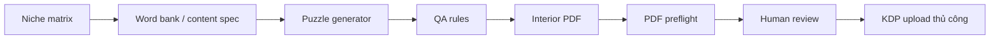

# Quy Trình Amazon KDP 12 Tuần

Nguồn phân tích: [[2026-08-15 — Lộ Trình Amazon POD Từ 50 Video]] · [[50 Video YouTube — Kinh Doanh POD Trên Amazon — 2025–2026]]

> [!abstract] Mục tiêu
> Hoàn thành một vòng kiểm chứng KDP từ nghiên cứu niche đến quyết định nhân rộng: **một niche được xác thực, một sản phẩm medium-content đạt chất lượng, một listing hoạt động và dữ liệu đủ để quyết định scale, sửa hoặc dừng**.

> [!tip] Sản phẩm nên bắt đầu
> Chọn **word search, puzzle hoặc activity book trong một ngách hẹp**. Không bắt đầu bằng blank journal đại trà, coloring book AI sản xuất hàng loạt hoặc sách high-content tốn nhiều vốn.

> [!info] Phân loại chính thức của Amazon
> “Medium-content” là thuật ngữ cộng đồng, không phải loại sách chính thức của KDP. Amazon cho biết puzzle book, activity book và coloring book **thường không được xem là low-content**, khác với notebook, planner và journal lặp lại. Vì vậy phải chọn đúng loại sách khi thiết lập ISBN, series và metadata. Xem [Low-Content Books](https://kdp.amazon.com/en_US/help/topic/GGE5T76TWKA85DJM).

## Nguyên tắc vận hành

1. Thử một sản phẩm trước khi xây danh mục.
2. Research thị trường trước khi thiết kế.
3. Chất lượng và quyền sử dụng quan trọng hơn tốc độ upload.
4. Organic validation trước; ads nhỏ dùng để học, không dùng để cứu sản phẩm yếu.
5. Tính hiệu quả bằng royalty thực nhận sau chi phí, không bằng gross sales.
6. Chỉ scale trong niche đã có tín hiệu.

## Đánh giá chiến lược — góc nhìn kinh doanh KDP

### Điểm tổng thể: 7,4/10 — Solid Go nhưng cần nâng cấp trước khi chi mạnh

| Hạng mục | Điểm chuyên gia | Đánh giá |
|---|---:|---|
| Trình tự thực thi | 8,5/10 | Đi đúng thứ tự research → sản phẩm → QA → traffic → dữ liệu |
| Tuân thủ và bảo vệ tài khoản | 9/10 | Compliance-first, tránh review swap và nội dung vi phạm |
| Xác thực thị trường | 6,5/10 | Có BSR/review nhưng còn phụ thuộc heuristic của creator |
| Unit economics | 6/10 | Có nhắc royalty nhưng chưa bắt buộc lập P&L trước khi chọn sản phẩm |
| Chất lượng sản phẩm | 8/10 | Có proof copy và Previewer, nhưng thiếu QA tự động |
| Marketing và chuyển đổi | 7/10 | Có organic và ads nhưng thiếu A+ Content/Author Central trước ads |
| Công nghệ và khả năng scale | 5/10 | Stack cũ là danh sách tool, chưa thành pipeline có dữ liệu và version |

### Điểm mạnh cần giữ

1. Chọn một sản phẩm để kiểm chứng trước khi xây catalog.
2. Ưu tiên niche hẹp thay vì blank journal hoặc chủ đề đại trà.
3. Có proof copy, Print Previewer và hồ sơ quyền sử dụng.
4. Chạy organic trước và xem ads là công cụ học dữ liệu.
5. Tính hiệu quả bằng royalty thay vì doanh thu quảng cáo gộp.
6. Không biến case study doanh thu thành kỳ vọng.

### Sáu thay đổi bắt buộc

1. **Dùng stage gate thay vì lịch cứng:** 12 tuần là khung quản lý, không phải thời gian bắt buộc. Có thể hoàn thành trong 6–8 tuần nếu sản phẩm đơn giản; không chuyển bước khi đầu ra chưa đạt.
2. **Lập unit economics trước khi sản xuất:** page count, trim size, loại mực, chi phí in, giá, royalty và CPC hòa vốn phải được tính trước khi chốt niche.
3. **Đổi “chọn niche” thành “chọn người mua + job-to-be-done”:** một từ khóa không đủ tạo lợi thế. Phải xác định ai mua, mua cho ai, dùng khi nào và vì sao chọn sách này.
4. **Không dùng BSR/review như chân lý:** BSR là tín hiệu tương đối và biến động; dữ liệu search volume của Book Bolt, BookBeam và Publisher Rocket đều là ước tính của bên thứ ba.
5. **Hoàn thiện detail page trước ads:** thêm Author Central, A+ Content, ảnh trang ruột và comparison module trước khi mua traffic. Amazon cũng khuyên chuẩn bị detail page trước khi quảng cáo.
6. **Xây lớp QA tự động:** phát hiện trang trùng, puzzle/đáp án sai, từ nhạy cảm, ảnh độ phân giải thấp, font chưa kiểm tra, page count và cấu trúc PDF.

### Cập nhật thị trường 2026 ảnh hưởng đến chiến lược

- **Broad coloring book có cầu nhưng bị thương hiệu hóa mạnh.** Danh sách bestseller của Amazon cho thấy Coco Wyo và các IP/licensed publisher chiếm nhiều vị trí nổi bật; người mới không nên cạnh tranh bằng phong cách “bold and easy” chung chung. Cần sub-niche, trải nghiệm hoặc định dạng khác biệt. Xem [Amazon Best Sellers — Children's Coloring Books](https://us.amazon.com/Best-Sellers-Books/zgbs/books/3374) và [Best Sellers 2025 in Books](https://www.amazon.com/gp/bestsellers/2025/books).
- **Puzzle/word search vẫn có nhu cầu nhưng generic keyword rất đông.** Bestseller hiện có cả thương hiệu puzzle lâu năm và nhiều dòng Kindle Scribe; lợi thế phải đến từ đối tượng, chủ đề, mức khó hoặc format, không chỉ “large print word search”. Xem [Amazon Best Sellers — Word Search](https://us.amazon.com/Best-Sellers-Kindle-Store-Word-Search/zgbs/digital-text/156412011).
- **Giá dưới 9,99 USD chịu economics kém hơn trước.** Với print book trên Amazon.com, mức giá từ 9,99 USD áp dụng royalty rate 60%; từ 9,98 USD trở xuống là 50%, sau đó vẫn trừ chi phí in. Không nên tự động launch ở 7,99–8,99 USD nếu chưa tính P&L. Xem [Print Book Pricing](https://kdp.amazon.com/en_US/help/topic/G8BKPU9AGVZSF9QF).
- **AI làm tốc độ tăng nhưng nâng rủi ro chất lượng và compliance.** KDP yêu cầu khai báo AI-generated text, image hoặc translation; chỉnh sửa nhiều sau khi AI tạo vẫn được xem là AI-generated. Xem [Content Guidelines](https://kdp.amazon.com/en_US/help/topic/G200672390).
- **A+ Content là tài sản chuyển đổi quan trọng.** KDP cho phép tối đa năm module trong một layout và có thể dùng ảnh, text, comparison table; công cụ AI A+ hiện có cho tiếng Anh tại Mỹ nhưng người xuất bản vẫn chịu trách nhiệm nội dung. Xem [Create A+ Content](https://kdp.amazon.com/en_US/help/topic/G8EP5W6H9CY7T8GS).

---

## Tuần 1 — Tài khoản và tuân thủ

### Việc cần làm

- [ ] Kiểm tra mình chỉ có một tài khoản KDP.
- [ ] Hoàn thiện danh tính, địa chỉ, thông tin thuế và phương thức nhận tiền.
- [ ] Đọc quy định KDP về nội dung, AI-generated, metadata, review và sở hữu trí tuệ.
- [ ] Tạo thư mục lưu license, hóa đơn, file thiết kế gốc và hợp đồng freelancer.
- [ ] Tạo bảng theo dõi sản phẩm và quyền sử dụng tài sản.

### Đầu ra

- [ ] KDP Bookshelf hoạt động.
- [ ] Thông tin thuế và nhận tiền hoàn chỉnh.
- [ ] Checklist tuân thủ được lưu.
- [ ] Hồ sơ bằng chứng quyền sử dụng được tạo.

### Cổng go/no-go

> [!warning]
> Nếu đã có tài khoản KDP khác, không tạo thêm. Liên hệ KDP để xử lý hoặc hợp nhất tài khoản trước khi tiếp tục.

---

## Tuần 2 — Nghiên cứu và chọn niche

### Công thức ý tưởng

`Loại hoạt động × đối tượng × sở thích/tình huống`

Ví dụ về cấu trúc, không phải niche mặc định để sao chép:

- Word search × người cao tuổi × du lịch.
- Puzzle × trẻ em × không gian.
- Activity book × người mới học × kỹ năng cụ thể.

### Việc cần làm

- [ ] Lập danh sách 20–30 ý tưởng.
- [ ] Tìm từng ý tưởng trên Amazon bằng cửa sổ ẩn danh.
- [ ] Đặt vị trí mua hàng tại Mỹ nếu nhắm Amazon.com.
- [ ] Ghi lại autosuggest cho từng cụm từ.
- [ ] Thu thập BSR, số review và tuổi listing của sản phẩm trang đầu.
- [ ] Đọc review 1–3 sao để tìm nhu cầu chưa được đáp ứng.
- [ ] Ghi người mua, người dùng, tình huống sử dụng và lý do mua.
- [ ] Lập ba cấu hình P&L theo page count, trim size, loại mực và giá bán.
- [ ] Kiểm tra trademark và quyền sử dụng cụm từ.
- [ ] Chọn ba niche vào vòng phân tích sâu.
- [ ] Chọn một niche cho sản phẩm thử nghiệm.

### Khung phân loại đối thủ

| Nhóm | Dấu hiệu | Ý nghĩa |
|---|---|---|
| Winner | BSR tốt, review chưa quá cao | Sản phẩm mới vẫn có khả năng bán |
| Authority | Thương hiệu/tác giả có lượng review áp đảo | Ngách có thể bị thương hiệu thống trị |
| Dead product | Có review nhưng BSR yếu | Có sản phẩm nhưng cầu hoặc offer không tốt |

### Heuristic tham khảo

- Tìm vài sản phẩm trang đầu có BSR khoảng dưới 50.000–80.000 nhưng chưa có hàng nghìn review.
- Một hướng dẫn trong bộ nguồn gợi ý ít nhất ba winner có BSR dưới 50.000 và dưới 150–200 review.
- Không chọn nếu chỉ một thương hiệu lớn bán được hoặc toàn bộ trang đầu có BSR yếu.

> [!note]
> Đây là heuristic của nhà sáng tạo, không phải tiêu chuẩn chính thức của Amazon. Không dùng một chỉ số duy nhất để quyết định.

### Đầu ra

- [ ] Bảng research 20–30 ý tưởng.
- [ ] Ba niche được chấm điểm.
- [ ] Một niche được chọn cùng lý do và bằng chứng.
- [ ] Một cấu hình sản phẩm có royalty và biên quảng cáo hợp lý.

### Unit economics bắt buộc

```text
Royalty mỗi đơn = Royalty rate × List price chưa thuế − Printing cost
Break-even ACoS xấp xỉ = Royalty mỗi đơn ÷ List price
CPC hòa vốn xấp xỉ = Royalty mỗi đơn × Tỷ lệ chuyển đổi thực tế
```

Dùng [KDP Printing Cost & Royalty Calculator](https://kdp.amazon.com/en_US/help/topic/G200735480) để lấy chi phí theo cấu hình thật. Chỉ tính CPC hòa vốn sau khi đã có conversion rate thực tế; không dùng tỷ lệ giả định để tăng ngân sách.

---

## Tuần 3 — Đặc tả sản phẩm

### Việc cần làm

- [ ] Chọn một định dạng: word search, puzzle hoặc activity book.
- [ ] Xác định người dùng cụ thể.
- [ ] Xác định tình huống sử dụng và lợi ích chính.
- [ ] Chọn mức độ khó.
- [ ] Chọn trim size và số trang dự kiến.
- [ ] Lập cấu trúc từng phần và quy tắc tạo nội dung.
- [ ] Phác thảo ba hướng bìa.
- [ ] Xác định phần nào dùng AI và phần nào làm thủ công.
- [ ] Tạo checklist QA cho ruột và bìa.

### Product brief tối thiểu

| Trường | Nội dung cần điền |
|---|---|
| Người dùng | Ai trực tiếp sử dụng sách? |
| Nhu cầu | Sách giúp họ làm gì? |
| Niche | Cụm tìm kiếm trọng tâm |
| Định dạng | Word search, puzzle hay activity book |
| Khác biệt | Tại sao chọn sách này thay vì sản phẩm trang đầu? |
| Nội dung | Số phần, mức khó, kiểu bài tập |
| Thiết kế | Phong cách bìa và ruột |
| Quyền sử dụng | Nguồn font, ảnh, nội dung và license |

### Cổng go/no-go

- [ ] Sản phẩm giải quyết nhu cầu cụ thể hơn blank journal chung chung.
- [ ] Có cách tạo nội dung nhất quán và kiểm tra được.
- [ ] Không phụ thuộc vào tài sản chưa rõ quyền sử dụng.

---

## Tuần 4 — Sản xuất ruột và bìa

### Ruột sách

- [ ] Tạo nội dung bằng Book Bolt Studio hoặc công cụ phù hợp.
- [ ] Kiểm tra từng puzzle và đáp án.
- [ ] Loại nội dung trùng, lỗi chính tả và trang lặp.
- [ ] Kiểm tra margin, số trang và thứ tự trang.
- [ ] Chèn trang hướng dẫn sử dụng nếu cần.

### Bìa sách

- [ ] Dùng KDP Cover Calculator theo đúng trim size, loại giấy và số trang thật.
- [ ] Thiết kế bìa trước, gáy và bìa sau theo template.
- [ ] Kiểm tra vùng barcode.
- [ ] Thu bìa xuống kích thước thumbnail để kiểm tra khả năng đọc.
- [ ] Xuất file theo thông số KDP hiện hành.

### Nếu sử dụng AI

- [ ] Kiểm tra từng hình và từng trang.
- [ ] Kiểm tra số ngón tay/chân, nét gãy, vùng xám và chi tiết chồng nhau.
- [ ] Kiểm tra tính nhất quán của nhân vật và phong cách.
- [ ] Lưu prompt, file nguồn và lịch sử chỉnh sửa.
- [ ] Đánh dấu để khai báo AI-generated khi xuất bản nếu AI tạo nội dung thực tế.

### Đầu ra

- [ ] File ruột hoàn chỉnh.
- [ ] File bìa hoàn chỉnh.
- [ ] Nhật ký quyền sử dụng cập nhật.
- [ ] Báo cáo QA nội bộ.

---

## Tuần 5 — Upload và tối ưu listing

### QA kỹ thuật

- [ ] Upload ruột và bìa.
- [ ] Chạy KDP Print Previewer.
- [ ] Sửa lỗi bleed, margin, gáy và barcode.
- [ ] Kiểm tra trang trắng ngoài ý muốn.
- [ ] Xác nhận không còn cảnh báo quan trọng.

### Metadata

- [ ] Title khớp chính xác với chữ trên bìa.
- [ ] Subtitle mô tả đúng người dùng và công năng.
- [ ] Description trình bày vấn đề, lợi ích, nội dung bên trong và CTA.
- [ ] Điền các cụm keyword có ý định tìm kiếm rõ ràng.
- [ ] Chọn category đúng nội dung và đối tượng.
- [ ] Khai báo AI-generated chính xác.
- [ ] Tính giá bằng KDP Royalty Calculator.

### Không sử dụng

- “Bestseller”, “free” hoặc tuyên bố về xếp hạng.
- Tên tác giả, thương hiệu hoặc sản phẩm đối thủ.
- Keyword không liên quan.
- Cam kết không kiểm soát được về giấy, đóng gáy hoặc vận chuyển.
- Chuỗi keyword nhồi nhét gây trải nghiệm đọc kém.

### Cổng go/no-go

- [ ] Previewer không còn lỗi.
- [ ] Metadata đúng với sản phẩm thực tế.
- [ ] Mọi tài sản đều có quyền sử dụng rõ ràng.
- [ ] Royalty sau chi phí in là số dương.

---

## Tuần 6 — Proof copy và soft launch

### Việc cần làm

- [ ] Đặt proof copy hoặc author copy nếu có thể.
- [ ] Kiểm tra màu, cắt xén, gáy và độ tương phản.
- [ ] Kiểm tra khả năng viết, tô hoặc giải puzzle.
- [ ] Kiểm tra đáp án và lỗi nội dung lần cuối.
- [ ] Sửa file nếu bản in không đạt.
- [ ] Quay video lật sách thật.
- [ ] Tạo ảnh trang ruột và mockup trung thực.
- [ ] Claim sách trong Amazon Author Central và hoàn thiện author profile.
- [ ] Tạo A+ Content với ảnh ruột, lợi ích và comparison module nếu phù hợp.

### Đầu ra

- [ ] Biên bản QA bản in.
- [ ] 5–10 tài sản nội dung marketing.
- [ ] Phiên bản listing sẵn sàng nhận traffic.
- [ ] Author Page và A+ Content đã gửi duyệt hoặc hoạt động.

> [!danger]
> Không chạy ads hoặc đẩy traffic khi chưa kiểm tra chất lượng bản in.

---

## Tuần 7–8 — Organic validation

### Nội dung nên thử

- [ ] Video lật sách.
- [ ] Giải thử một puzzle.
- [ ] Timelapse sử dụng.
- [ ] Giới thiệu một trang nổi bật.
- [ ] Hậu trường thiết kế.
- [ ] Một lỗi đã phát hiện và cách sửa.

### Kênh

- TikTok và Instagram: trình diễn nhanh, video ngắn.
- Pinterest: hình ảnh và nhu cầu tìm kiếm dài hạn.
- Cộng đồng liên quan: chia sẻ giá trị trước, không spam link.

### Chẩn đoán phễu

| Hiện tượng | Vấn đề có thể nằm ở | Hành động |
|---|---|---|
| Không có impression | Index, niche hoặc keyword | Kiểm tra listing và nhu cầu |
| Có impression, không click | Bìa, title hoặc lời hứa | Thử bìa/title rõ hơn |
| Có click, không mua | Giá, ruột, mockup hoặc độ tin cậy | Kiểm tra offer và sản phẩm |
| Có đơn | Niche, keyword hoặc nội dung đang đúng | Ghi lại nguồn tín hiệu để nhân rộng |

### Quy tắc review

- [ ] Không review swap.
- [ ] Không tặng quà để đổi review.
- [ ] Không yêu cầu review tích cực.
- [ ] Bản tặng/giảm giá chỉ dùng khi không bắt buộc hoặc định hướng nội dung review.

---

## Tuần 9–10 — Amazon Ads quy mô nhỏ

### Điều kiện bắt đầu

- [ ] Bản in đã qua QA.
- [ ] Metadata hoàn chỉnh.
- [ ] Listing giải thích rõ sản phẩm.
- [ ] Đã tính royalty hòa vốn.

### Cấu trúc thử nghiệm

1. Auto campaign để tìm search term.
2. Manual broad/phrase cho nhóm keyword đã research.
3. Product targeting theo ASIN đối thủ liên quan.
4. Thêm negative targeting khi báo cáo cho thấy truy vấn không liên quan.
5. Chọn `Dynamic bids — down only` trong giai đoạn kiểm chứng.
6. Bắt đầu với ngân sách nhỏ và bid phù hợp royalty.

Một video trong bộ nguồn sử dụng khoảng 3–5 USD/ngày và CPC khởi điểm thấp. Đây là điểm bắt đầu thử nghiệm, không phải ngân sách bắt buộc.

### Công thức kiểm soát tiền

`Lợi nhuận quảng cáo = Royalty thực nhận − Ad spend`

> [!warning]
> Gross sales trên Ads Dashboard không phải tiền bạn được nhận. Phải dùng royalty sau chi phí in để tính hòa vốn.

### Tối ưu

- [ ] Không kết luận sau vài impression.
- [ ] Kiểm tra search term và ASIN thực tế.
- [ ] Tải Search Term, Targeting và Advertised Product reports.
- [ ] Hạ bid hoặc tắt truy vấn tiêu tiền nhưng không chuyển đổi.
- [ ] Chuyển keyword/ASIN có nhiều đơn sang exact campaign.
- [ ] Không tăng ngân sách nếu listing chưa chuyển đổi.

---

## Tuần 11–12 — Scale, sửa hoặc dừng

### Scale khi

- [ ] Có đơn hàng lặp lại.
- [ ] Có keyword hoặc ASIN tạo nhiều chuyển đổi.
- [ ] Không có phản hồi chất lượng nghiêm trọng.
- [ ] Royalty sau ads phù hợp mục tiêu.

### Cách scale

- [ ] Làm cuốn thứ hai cho cùng người mua.
- [ ] Giữ phong cách thương hiệu nhất quán.
- [ ] Xây series trong cùng niche.
- [ ] Tập trung ngân sách vào keyword đã chuyển đổi.
- [ ] Chỉ tạo compilation khi mô tả chính xác và có thêm giá trị thực.

### Sửa khi

- Niche có cầu nhưng bìa hoặc listing chuyển đổi thấp.
- Phản hồi chỉ ra lỗi sản phẩm có thể khắc phục.
- Traffic liên quan nhưng giá hoặc offer chưa phù hợp.

### Dừng khi

- Không chứng minh được nhu cầu.
- Quyền sở hữu không rõ ràng.
- Sản phẩm cần chi phí vượt quá nguồn lực hiện tại.
- Niche bị một thương hiệu lớn thống trị và không có khoảng trống rõ ràng.

---

## Dashboard theo dõi tối thiểu

| Nhóm dữ liệu | Chỉ số cần ghi |
|---|---|
| Niche | Keyword, BSR, review, authority và dead products |
| Listing | Impression, click và conversion |
| Bán hàng | Đơn, giá bán và royalty |
| Ads | Spend, CPC, search term, đơn quảng cáo và royalty sau ads |
| Nội dung | Kênh, nội dung, lượt xem, click và đơn liên quan |
| Chất lượng | Review, phản hồi, lỗi và phiên bản đã sửa |

## Bộ công cụ tối giản

### Stack bootstrap đề xuất

Nguyên tắc: **không mua Book Bolt, BookBeam và Publisher Rocket cùng lúc**. Với sản phẩm đầu tiên là puzzle/word search, Book Bolt Pro bao phủ cả research, thiết kế và tạo puzzle nên là lựa chọn trả phí đầu tiên hợp lý nhất.

| Giai đoạn | Công cụ chính | Chi phí tham khảo | Vai trò | Khi chưa cần |
|---|---|---:|---|---|
| Quản trị | Obsidian + Google Drive/Sheets | 0 USD | Product database, rights log, P&L, version và checklist | Không cần Notion/ClickUp riêng |
| Chính sách | KDP Help Center + [USPTO Trademark Search](https://www.uspto.gov/trademarks/search) | 0 USD | Kiểm tra quy định, trademark chữ và hình | Không mua dịch vụ trademark tự động ngay |
| Research cơ bản | Amazon Search + autosuggest + [DS Amazon Quick View](https://chromewebstore.google.com/detail/ds-amazon-quick-view/jkompbllimaoekaogchhkmkdogpkhojg) | 0 USD | BSR, seller data, trang đầu và signal thực tế | Dùng trước mọi tool ước tính |
| Research + tạo puzzle | Book Bolt Pro | 23,99 USD/tháng; 19,99 USD/tháng nếu trả năm | Keyword/product research, Studio, puzzle, crossword và sudoku | Chỉ mua một tháng đầu; gia hạn khi dùng thật |
| Thiết kế | Canva Free | 0 USD | Bìa, A+ Content, mockup và social asset | Chưa cần Pro nếu chưa dùng resize/remove background |
| Thiết kế nâng cấp | Canva Pro | 144 USD/năm | Premium asset, resize, remove background, brand kit | Chỉ mua khi Canva Free tạo bottleneck |
| AI | ChatGPT/Claude hiện có | Chi phí hiện hữu | Idea, outline, word bank, metadata draft và QA hỗ trợ | Không dùng để xuất bản batch chưa kiểm tra |
| Viết tiếng Anh | Grammarly Free | 0 USD | Chính tả, grammar và tone cơ bản | Pro 12 USD/tháng trả năm chỉ cần cho high-content |
| Kỹ thuật KDP | Cover Calculator + Print Previewer + Royalty Calculator | 0 USD | Kích thước, preflight và economics chính thức | Không thay bằng số từ YouTube |
| Detail page | Author Central + A+ Content | 0 USD | Uy tín tác giả, ảnh ruột và conversion | Hoàn thiện trước ads |
| Organic | Canva/CapCut + TikTok/Instagram/Pinterest | 0 USD cơ bản | Flip-through, demo puzzle và content repurpose | Không cần Placeit khi Canva đủ dùng |
| Ads | Amazon Ads Console | 0 USD phí phần mềm; trả CPC | Sponsored Products, target và reports | Sponsored Brands chỉ sau khi có ≥3 title đủ điều kiện |
| Analytics | KDP Reports + Amazon Ads reports + Google Sheets | 0 USD | Orders, royalty, spend, search terms và P&L | Chưa cần dashboard trả phí |

Giá được kiểm tra ngày 15/08/2026 từ [Book Bolt Pricing](https://bookbolt.io/pricing/), [Canva Pricing](https://www.canva.com/pricing/), [Grammarly Plans](https://www.grammarly.com/plans) và các công cụ KDP chính thức. Giá có thể thay đổi theo quốc gia và chu kỳ thanh toán.

### Công cụ chỉ mua khi đã có tín hiệu

| Công cụ | Giá hiện tại | Mua khi | Không mua khi |
|---|---:|---|---|
| Publisher Rocket | 199 USD một lần | Có 3–5 title, cần reverse ASIN, category, keyword và ads research thường xuyên | Đang làm sản phẩm đầu tiên và Book Bolt đã đủ |
| BookBeam Basic | 47 USD/tháng hoặc 29 USD/tháng trả năm | Cần BSR history, book tracking và keyword rank tracking trên nhiều marketplace | Chưa có catalog hoặc chưa thu hồi nổi chi phí tool |
| Creative Fabrica | Theo gói hoặc từng asset | Cần font/graphics có license rõ và lưu được chứng từ | Không hiểu Basic POD và Full POD license |

Publisher Rocket hiện bán lifetime 199 USD và gồm keyword, competition, category, reverse ASIN và Amazon Ads research; BookBeam Basic niêm yết 47 USD/tháng. Xem [Publisher Rocket](https://publisherrocket.com/homepage-international/) và [BookBeam Pricing](https://bookbeam.io/pricing/).

> [!warning] License asset không đơn giản
> Với Creative Fabrica, Basic POD thường yêu cầu biến đổi đáng kể; Full POD và quyền sau khi hủy subscription có điều kiện khác nhau. Ưu tiên asset tự tạo hoặc mua single-sale license, lưu snapshot license tại ngày tải. Xem [Creative Fabrica POD License](https://help.creativefabrica.com/hc/en-us/articles/360031036351-How-to-use-fonts-and-designs-on-Print-On-Demand-POD-sites-with-Basic-POD-License).

### Công nghệ cho từng tuần

| Tuần/gate | Workflow công nghệ | Đầu ra dữ liệu |
|---|---|---|
| 1 | Obsidian + Drive + USPTO + KDP Help | `rights-log`, `policy-checklist`, cấu trúc version |
| 2 | Amazon Search + DS Quick View + Book Bolt + Sheets | Niche matrix, competitor snapshot, ba P&L scenario |
| 3 | Obsidian product brief + ChatGPT/Claude + Sheets | Product spec, word-bank rules, QA rules |
| 4 | Book Bolt Studio + Canva + pipeline QA | Interior PDF, cover PDF, validation report |
| 5 | KDP calculators + Print Previewer + metadata sheet | Upload package và metadata version 1 |
| 6 | Proof copy + Canva + Author Central + A+ Content | QA report, A+ modules và launch assets |
| 7–8 | CapCut/Canva + social channels + link tracker | Content log, click signal và feedback |
| 9–10 | Amazon Ads + Search Term Report + Sheets | Keyword/ASIN P&L và negative list |
| 11–12 | KDP Reports + Ads reports + decision dashboard | Quyết định scale, sửa hoặc dừng |

### Lớp tự động hóa phù hợp lợi thế của Tony

Không tự động upload vào KDP. Chỉ tự động hóa khâu chuẩn bị và QA:



Stack kỹ thuật khi đã hoàn thành sản phẩm đầu tiên bằng tay:

- **Python + CSV/Google Sheets:** quản lý word bank, chủ đề, đáp án và version.
- **PyMuPDF:** đọc page size, text, font, image metadata và hash để phát hiện ảnh/trang trùng.
- **Pillow:** kiểm tra kích thước, mode màu và độ phân giải ảnh nguồn.
- **qpdf:** kiểm tra cấu trúc, encryption và stream của PDF.
- **fontTools:** kiểm tra metadata font; quyền license vẫn phải đọc từ EULA/hóa đơn, tool không tự xác nhận quyền thương mại.
- **pytest hoặc validator riêng:** kiểm tra số puzzle, đáp án, từ trùng, từ cấm, page count và naming convention.

Tài liệu kỹ thuật: [PyMuPDF](https://pymupdf.readthedocs.io/en/latest/), [qpdf](https://qpdf.readthedocs.io/en/12.0/cli.html), [Pillow](https://pillow.readthedocs.io/en/stable/) và [fontTools](https://fonttools.readthedocs.io/en/stable/).

### Ngân sách khuyến nghị

| Cấu hình | Công cụ trả phí mới | Chi phí |
|---|---|---:|
| Sản phẩm đầu tiên | Book Bolt Pro một tháng | 23,99 USD |
| Bootstrap có Canva Pro | Book Bolt Pro + Canva Pro quy đổi tháng | khoảng 35,99 USD/tháng |
| Sau khi có 3–5 title | Thêm Publisher Rocket lifetime | thêm 199 USD một lần |
| Publisher có catalog lớn | BookBeam Basic | thêm 47 USD/tháng; chỉ khi ROI chứng minh được |

Không tính phí AI đang dùng và ad spend. Ngân sách quảng cáo là biến phí riêng, chỉ mở sau khi đã tính royalty hòa vốn.

## Quy tắc an toàn bắt buộc

- Không tạo nhiều tài khoản KDP.
- Không review swap hoặc mua review.
- Không dùng người nổi tiếng, thương hiệu, phim, game hoặc đội thể thao khi chưa có quyền.
- Không xuất bản nhiều sách chỉ đổi bìa nhưng ruột giống nhau.
- Không upload hàng loạt nội dung AI chưa QA.
- Không xem doanh thu trong video là kết quả điển hình.
- Không chạy ads khi chưa biết royalty hòa vốn.
- Không xem điểm số từ tool là bằng chứng duy nhất của nhu cầu.

## Tài liệu chính thức cần kiểm tra trước khi xuất bản

- [KDP Content Guidelines](https://kdp.amazon.com/en_US/help/topic/G200672390)
- [Metadata Guidelines for Books](https://kdp.amazon.com/en_US/help/topic/G201097560)
- [Customer Reviews](https://kdp.amazon.com/en_US/help/topic/G202101910)
- [Intellectual Property Rights FAQ](https://kdp.amazon.com/en_US/help/topic/G200672400)
- [Guide to Kindle Content Quality](https://kdp.amazon.com/en_US/help/topic/G200952510)
- [Print Book Pricing](https://kdp.amazon.com/en_US/help/topic/G8BKPU9AGVZSF9QF)
- [KDP Tools and Resources](https://kdp.amazon.com/en_US/help/topic/G200735480)
- [Create A+ Content](https://kdp.amazon.com/en_US/help/topic/G8EP5W6H9CY7T8GS)
- [Amazon Author Central](https://kdp.amazon.com/en_US/help/topic/G200644310)
- [Advertising for KDP Books](https://kdp.amazon.com/en_US/help/topic/G201499010)
- [Sponsored Products Targeting](https://advertising.amazon.com/library/guides/targeting-with-sponsored-products)
- [Book Advertising Reports](https://advertising.amazon.com/en-us/library/guides/book-advertising-reporting/)
- [KDP Reports](https://kdp.amazon.com/en_US/help/topic/GVTTXHKHVPAPBEDQ)
- [Sales and Royalties Report](https://kdp.amazon.com/en_US/help/topic/G201488550)
- [Avoiding Publisher-Directed Purchase Manipulation](https://kdp.amazon.com/en_US/help/topic/G201723090)

> [!success] Hoàn thành vòng đầu khi
> Một sản phẩm đã được xuất bản sạch chính sách, bản in đạt chất lượng, listing nhận được traffic liên quan và dữ liệu đủ để quyết định **scale, sửa hoặc dừng**.
