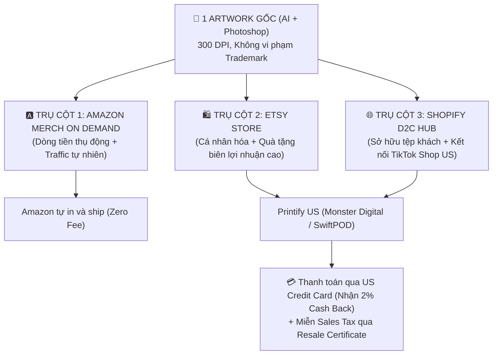

# CẨM NANG THỰC CHIẾN POD TOÀN DIỆN CHO US CITIZEN (2026)
## HỆ SINH THÁI 3 TRỤ CỘT: AMAZON MERCH × ETSY × SHOPIFY

> **Dành riêng cho**: Người có tư cách pháp nhân Mỹ (US Citizen / US Resident có SSN, US Bank, Residential IP).
> **Mục tiêu**: Xây dựng cỗ máy kinh doanh Print on Demand (POD) đa kênh, tối ưu hoá dòng tiền, tự động hóa in ấn và sở hữu thương hiệu lâu dài.

---

## 1. BẢN ĐỒ CHIẾN LƯỢC: HỆ SINH THÁI 3 TRỤ CỘT (THE TRI-PILLAR ENGINE)

Thay vì chỉ làm một sàn đơn lẻ, mô hình tối ưu nhất cho US Citizen năm 2026 là **tái sử dụng 1 mẫu thiết kế (Artwork) trên 3 kênh có đặc tính bổ trợ hoàn hảo cho nhau**:



### So Sánh Vai Trò Của 3 Kênh:
| Tiêu chí | Amazon Merch on Demand | Etsy POD | Shopify D2C (+ TikTok Shop US) |
|---|---|---|---|
| **Vai trò chính** | Máy in tiền tự động từ organic search của Amazon | Khai thác ngách sâu, quà tặng, đồ custom cá nhân hoá | Xây dựng tài sản thương hiệu, thu thập Email/SMS, scale Ads |
| **Vốn & Phí duy trì** | $0 vốn, $0 phí hàng tháng | $0.20/listing (4 tháng) | $39/tháng Shopify + Domain |
| **Đơn vị Fulfillment** | Amazon tự in, đóng gói và ship (FBA native) | Printify / Gelato (Chọn xưởng in nội địa Mỹ) | Printify / Gelato tự động sync |
| **Biên lợi nhuận ròng** | $3 - $7 / sản phẩm (Royalty) | $6 - $12 / sản phẩm | $10 - $20 / sản phẩm |
| **Điểm đặc biệt 2026** | Phân tầng Royalty mới (Creator / Plus / Premium khi kéo external traffic) | Quy chuẩn **Creativity Standards 2026** siết chặt thiết kế gốc | Bắt buộc liên kết **TikTok Shop US** để đón sóng mua sắm video |

---

## 2. GIAI ĐOẠN 1: THIẾT LẬP NỀN TẢNG PHÁP LÝ & TÀI CHÍNH (XONG TRONG 1-2 NGÀY)

Là US Citizen, bạn có "Unfair Advantage" cực lớn. Hãy kích hoạt ngay 4 công cụ đòn bẩy tài chính sau:

### 1.1. Pháp nhân & Thuế (Tax Setup)
- **Hình thức đăng ký**: 
  - Khởi đầu nhanh: Dùng **SSN cá nhân** (Sole Proprietorship).
  - Khởi đầu chuẩn scale: Lập **Single-Member LLC** tại bang của bạn (hoặc Wyoming/Delaware) + lấy mã **EIN** từ IRS để tách biệt hoàn toàn tài sản cá nhân khỏi rủi ro kinh doanh.
- **Khai thuế W-9**: Khai báo form W-9 trên Amazon, Etsy, Shopify, Printify. Cuối năm nhận các biểu mẫu **Form 1099-K** để khai thuế dễ dàng.

### 1.2. Đòn bẩy dòng tiền: Thẻ tín dụng Cash Back Mỹ
- Đăng ký thẻ tín dụng doanh nghiệp hoặc cá nhân có chính sách hoàn tiền cao cho chi tiêu kinh doanh:
  - *Chase Ink Business Unlimited / Cash*: 1.5% - 5% Cash back.
  - *Capital One Spark Cash Plus*: 2% Cash back unlimited.
  - *Amex Blue Business Cash*: 2% Cash back.
- **Tác dụng**: Dùng thẻ này làm nguồn thanh toán mặc định trên Printify. Ví dụ: Fulfill $10,000 tiền in áo -> Bạn nhận lại **$200 tiền mặt miễn phí** (tăng trực tiếp vào lợi nhuận ròng).

### 1.3. Đăng ký Giấy Phép Bán Lại (Resale Certificate / Sales Tax Exemption)
- Truy cập cổng dịch vụ thuế của bang (Department of Revenue) đăng ký **Sales Tax Permit / Resale Certificate**.
- Tải giấy chứng nhận này lên tài khoản **Printify / Gelato (mục Taxes)**.
- **Lợi ích**: Khi Printify sản xuất áo cho bạn, họ sẽ **miễn 100% Sales Tax (thường là 6% - 9%)** vì bạn mua sỉ để bán lại cho người tiêu dùng cuối.

---

## 3. GIAI ĐOẠN 2: THIẾT LẬP 3 GIAN HÀNG CHÍNH THỨC

### 3.1. Kênh 1: Amazon Merch on Demand (Đăng ký ngay ngày đầu)
1. Truy cập `merch.amazon.com`, đăng nhập bằng tài khoản Amazon US chính chủ.
2. Điền thông tin: US Business/Personal Name, SSN/EIN, Checking Account ngân hàng Mỹ (Chase, BoA...).
3. **Phần viết đơn (Application Note)**: Viết bằng tiếng Anh ngắn gọn, chuyên nghiệp:
   - *Ví dụ mẫu*: *"I am an independent graphic designer based in the US specializing in original typography and vector illustrations for apparel. I have an established portfolio and fully understand Amazon's intellectual property and trademark policies. I plan to publish unique, high-quality designs tailored to US holidays, hobbies, and evergreen niches."*
4. Đính kèm link portfolio cá nhân (Behance, Dribbble, hoặc Shopify store mẫu).

### 3.2. Kênh 2: Etsy Store (Chuẩn hoá theo Creativity Standards 2026)
1. Mở shop Etsy bằng IP dân cư Mỹ chính chủ, liên kết US Checking Account.
2. **Khai báo đối tác in (Production Partner Disclosure - Bắt buộc theo luật Etsy 2026)**:
   - Vào *Shop Manager -> Settings -> Production Partners -> Add Partner*.
   - Đặt tên: *"Printify - Monster Digital"* (hoặc SwiftPOD).
   - Địa chỉ: United States.
   - Vai trò: *"They print and ship items using my original designs and technical art files"*.
3. **Cài đặt Listing Attributes**:
   - *Who made it*: **I did** (hoặc "A member of my shop").
   - *What is it*: **A finished product**.
   - *When was it made*: **Made to order**.
4. **Mẫu thông báo sử dụng AI (Bắt buộc theo chính sách 2026)**: Thêm vào cuối mô tả sản phẩm:
   - *"Original artwork designed by [Tên Shop] with creative digital rendering and AI assistance, refined in Adobe Photoshop for premium print clarity."*

### 3.3. Kênh 3: Shopify D2C + TikTok Shop US Hub
1. Đăng ký Shopify (dùng gói ưu đãi $1/tháng).
2. Mua tên miền `.com` ngắn gọn (thông qua Namecheap hoặc Shopify Domains).
3. Cài đặt các ứng dụng cốt lõi:
   - **Printify**: Tự động đồng bộ catalog sản phẩm, mockup và đơn hàng.
   - **TikTok App for Shopify**: Kết nối trực tiếp với **TikTok Shop US Seller Center** (Dùng SSN/Driver License Mỹ để duyệt trong 24h).
   - **Klaviyo**: Cài đặt hệ thống email marketing tự động.
   - **Judge.me**: Thu thập đánh giá kèm hình ảnh thực tế từ khách hàng.

---

## 4. GIAI ĐOẠN 3: NGHIÊN CỨU THỊ TRƯỜNG & SĂN TREND NĂM 2026

### 4.1. Tiêu Chuẩn Chọn "Niche Sạch & Giàu Lợi Nhuận"
- **Quy tắc 3 Không**:
  1. *Không dính Trademark*: Tuyệt đối không chứa tên thương hiệu, ca sĩ, phim ảnh, logo thể thao (Disney, Marvel, Taylor Swift, NFL, Nike...).
  2. *Không nhái 1:1*: Không copy nguyên xi thiết kế của người khác; chỉ học cấu trúc bố cục và thông điệp rồi làm lại đẹp hơn, nét hơn.
  3. *Không làm ngách quá rộng*: Tránh làm áo "Cat Shirt" hay "Dog Shirt" chung chung. Hãy đi sâu vào vi ngách: *"Funny Orange Cat Mom", "Vintage Black Cat Gardening Club", "Introvert Bookworm Coffee Lover"*.

### 4.2. Bộ Công Cụ Nghiên Cứu Chuyên Dụng
1. **Helium 10 / Merch Informer**:
   - Dùng tính năng *Black Box* & *Cerebro* để tìm các từ khoá trên Amazon US có Search Volume > 1,000 nhưng số lượng đối thủ cạnh tranh < 500.
2. **EverBee / eRank (Dành cho Etsy)**:
   - Tìm các listing Etsy có Monthly Sales > 50 đơn và Estimated Revenue > $1,000/tháng để phân tích phong cách thiết kế được ưa chuộng.
3. **TMHunt & USPTO TESS (Kiểm tra Trademark)**:
   - Mọi từ, câu slogan đưa vào áo thun (Class 025) hoặc ly cốc (Class 021) đều phải gõ vào `tmhunt.com` và `uspto.gov` để đảm bảo chưa có ai đăng ký bảo hộ độc quyền.

---

## 5. GIAI ĐOẠN 4: QUY TRÌNH SẢN XUẤT THIẾT KẾ AI & PHOTOSHOP

### 5.1. Tạo Artwork Đỉnh Cao Bằng Midjourney v6
- Cấu trúc Prompt tạo thiết kế áo POD chuẩn:
  ```text
  [Subject / Concept], [Style: vintage retro / minimalist line art / bold typography], vector graphic, vibrant colors, clean edges, isolated on pure black background, t-shirt design, screen printing aesthetic, 8k resolution --ar 1:1 --v 6.0 --style raw
  ```
- **Ví dụ thực chiến**:
  - *Áo ngách cắm trại*: `Retro vintage sunset mountain landscape with a funny camper van, adventurous camping quote typography, distressed screen print, isolated on black background, vector apparel design --v 6.0`
  - *Pattern ly Tumbler 20oz*: `Seamless watercolor pattern of cute wild flowers and honey bees, delicate botanical illustration, surface pattern design, 300 dpi --ar 9:16 --v 6.0`

### 5.2. Hậu Kỳ Photoshop (Tách Nền & Chuẩn Hoá 300 DPI)
1. Đưa file ảnh vào Photoshop.
2. Dùng công cụ **Select Subject** hoặc **Background Eraser** để xoá nền đen/trắng, tạo file trong suốt (Transparent PNG).
3. Sử dụng công cụ **AI Upscaler** (Topaz Gigapixel hoặc Vectorizer.ai) để nâng kích thước lên chuẩn:
   - Kích thước chuẩn áo thun Merch & Printify: **4500 × 5400 pixels (300 DPI)**.
   - Kích thước ly Tumbler 20oz: **2790 × 2460 pixels (300 DPI)**.
   - Kích thước tranh Canvas / Poster: **6000 × 9000 pixels (300 DPI)**.

---

## 6. GIAI ĐOẠN 5: CHIẾN LƯỢC ĐĂNG BÁN & VẬN HÀNH TỪNG KÊNH

### 6.1. Chiến Lược Cho Amazon Merch on Demand
- **Vượt Tier 10 Thần Tốc**:
  - Giai đoạn đầu bạn chỉ có 10 slot upload. Hãy chọn 10 mẫu thiết kế tốt nhất cho 10 ngày lễ hoặc ngách có nhu cầu mua ngay.
  - Định giá thấp để lấy đơn đầu ($13.99 - $14.99 cho áo thun Standard) để kích hoạt sale nhanh và thăng hạng lên **Tier 25 -> Tier 100**.
- **Tận Dụng Chính Sách Royalty 2026**:
  - Tạo các video ngắn trên TikTok/Reels gắn link Amazon Merch để kéo external traffic -> Nhận mức Royalty Premium cao hơn so với chỉ dựa vào organic search nội sàn.
- **Quy Tắc Metadata Tránh Ban**:
  - *Brand Name*: Đặt tên thương hiệu riêng, không nhồi nhét từ khoá ("Funny Shirts Store").
  - *Title*: Mô tả đúng sản phẩm + thông điệp + đối tượng tặng quà ("Funny Vintage Camping T-Shirt Cool Camper Gift for Men Women").
  - *Bullet Points*: Viết 2 câu tự nhiên giải thích tại sao chiếc áo này là món quà hoàn hảo, chất liệu cotton mềm mại, không lặp lại từ khóa.

### 6.2. Chiến Lược Cho Etsy Store
- **Tập Trung Vào Cá Nhân Hóa (Personalization)**:
  - Khách hàng trên Etsy sẵn sàng trả $28 - $35 cho một chiếc áo thun nếu có thể in tên của họ, tên thú cưng hoặc ngày kỷ niệm.
  - Bật tính năng *"Add your personalization"* trên listing Etsy. Khi có đơn, mở file Photoshop thay tên khách vào và đặt in trên Printify.
- **Tối Ưu Listing SEO 2026**:
  - Điền đủ **13 Tags** (mỗi tag là 1 cụm từ tìm kiếm dài mà khách hàng thường gõ, ví dụ: *"retro camp shirt"*, *"funny outdoor gift"*, *"nature lover tee"*).
  - Sử dụng ảnh Mockup người thật phong cách đời thường (Lifestyle Mockups) mua từ các shop bán mockup chuyên nghiệp trên Etsy hoặc tự tạo qua PlaceIt.

### 6.3. Chiến Lược Cho Shopify & TikTok Shop US
- **Thiết Lập 3 Chuỗi Email Tự Động Trên Klaviyo (Bắt Buộc)**:
  1. *Welcome Series (3 emails)*: Chào mừng khách mới, kể câu chuyện thương hiệu, tặng mã giảm giá 10% cho đơn đầu tiên.
  2. *Abandoned Checkout Flow (4 emails)*: Nhắc nhở giỏ hàng bị bỏ quên sau 1h, 12h, 24h kèm hình ảnh sản phẩm và đánh giá xã hội (Social Proof).
  3. *Post-Purchase Thank You*: Cảm ơn khách hàng, hướng dẫn cách giặt áo bảo quản hình in bền đẹp, tặng mã giảm 15% cho đơn tiếp theo.
- **Khai Thác TikTok Shop US**:
  - Gửi mẫu sản phẩm thực tế (Free Samples) cho các nhà sáng tạo nội dung (TikTok Creators) trong ngách qua tính năng **Affiliate Center** trên TikTok Shop với mức hoa hồng 15% - 20%.
  - Khi creator quay video gắn giỏ hàng sản phẩm của bạn, đơn hàng sẽ tự động nhảy về Printify để in và ship, tạo ra nguồn doanh thu thụ động khổng lồ.

---

## 7. GIAI ĐOẠN 6: CHỌN NHÀ IN & TỰ ĐỘNG HÓA FULFILLMENT TẠI MỸ

Để duy trì đánh giá 5 sao và bảo vệ tài khoản khỏi các cảnh báo trễ hạn, bạn **bắt buộc phải chọn các nhà in nội địa Mỹ (US Print Providers)** có điểm đánh giá chất lượng từ 9.0 trở lên trên Printify:

| Nhà in trên Printify | Điểm chất lượng | Sản phẩm thế mạnh | Thời gian sản xuất trung bình |
|---|---|---|---|
| **Monster Digital** | 9.6 / 10 | Áo thun Gildan 5000, Bella+Canvas 3001, Comfort Colors 1717 | 1.4 ngày làm việc |
| **SwiftPOD** | 9.5 / 10 | Hoodie Gildan 18500, Sweatshirt 18000, Áo thun trẻ em | 1.8 ngày làm việc |
| **Dimona Tee** | 9.3 / 10 | Direct-to-Garment (DTG) màu sắc sắc nét | 1.6 ngày làm việc |
| **SPOKE Custom** | 9.4 / 10 | Ly sứ, Ly Tumbler thép không gỉ 20oz | 2.1 ngày làm việc |

---

## 8. CHECKLIST 30 NGÀY HÀNH ĐỘNG CHO BẠN (ACTION PLAN)

### Tuần 1: Setup Nền Tảng & Nộp Đơn
- [ ] Xác định dùng SSN cá nhân hoặc lập Single-Member LLC.
- [ ] Mở thẻ Credit Card US hoàn tiền 2% (Chase/Capital One/Amex).
- [ ] Đăng ký Resale Certificate tại bang và nộp lên Printify để miễn Sales Tax.
- [ ] Nộp đơn đăng ký tài khoản **Amazon Merch on Demand**.
- [ ] Mở gian hàng **Etsy US Store** và cấu hình Production Partner (Printify).
- [ ] Mở gian hàng **Shopify**, gắn domain và kết nối tài khoản **TikTok Shop US Seller Center**.

### Tuần 2: Nghiên Cứu & Chuẩn Bị Bộ 20 Artwork Đầu Tiên
- [ ] Dùng Helium 10 / EverBee tìm 5 ngách sạch tiềm năng (Nghề nghiệp, Thú cưng, Sở thích ngoài trời, Quà tặng gia đình).
- [ ] Kiểm tra 100% từ khoá và câu chữ qua TMHunt & USPTO.
- [ ] Dùng Midjourney tạo 20 mẫu thiết kế vector độ nét cao.
- [ ] Dùng Photoshop tách nền trong suốt, căn chỉnh tỉ lệ 4500 × 5400 px, 300 DPI.
- [ ] Tạo bộ Mockup người thật phong cách Mỹ chuyên nghiệp trên PlaceIt / Canva.

### Tuần 3: Đăng Tải Đồng Loạt Lên 3 Kênh
- [ ] Tải 10 thiết kế lên Amazon Merch on Demand (nếu đã được duyệt) để lấp đầy Tier 10.
- [ ] Đăng toàn bộ 20 sản phẩm lên Etsy với 13 tags chuẩn SEO và tính năng Personalization.
- [ ] Đăng 20 sản phẩm lên Shopify, kích hoạt đồng bộ sang TikTok Shop US.
- [ ] Thiết lập 3 luồng email tự động cơ bản trên Klaviyo (Welcome, Abandoned Cart, Post-Purchase).

### Tuần 4: Kéo Traffic, Đo Lường & Tối Ưu
- [ ] Đặt in mẫu (Sample Orders) 2-3 sản phẩm bán chạy nhất về nhà để kiểm tra chất vải và chất lượng in.
- [ ] Tự quay hoặc gửi mẫu cho 5 TikTok Creators để làm video ngắn gắn giỏ hàng TikTok Shop US.
- [ ] Theo dõi chỉ số chuyển đổi, tối ưu lại Title/Keywords cho các listing chưa có lượt xem.
- [ ] Tái đầu tư lợi nhuận vào việc mở rộng thêm các dòng sản phẩm mới (Hoodie, Tumbler, Hat, Tote Bag).

---

## 9. LIÊN KẾT TRONG OBSIDIAN VAULT

- [[04. Resources/Market & Competitor Research/Video AI/NotebookLM/2026-08-21 — Quy Trình Kinh Doanh POD Toàn Diện A-Z (LeLife).md]]
- [[04. Resources/Market & Competitor Research/Video AI/NotebookLM/2026-08-21 — Kho Tri Thức LeLife POD — Tổng Hợp Toàn Bộ Video.md]]
- [[04. Resources/Market & Competitor Research/Video AI/NotebookLM/2026-08-15 — Lộ Trình Amazon POD Từ 50 Video.md]]