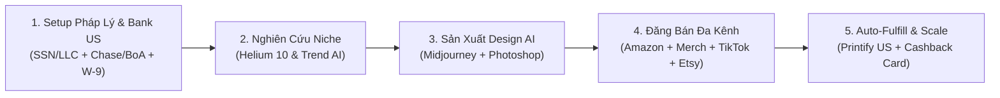

# CẨM NANG TOÀN DIỆN: QUY TRÌNH KINH DOANH PRINT ON DEMAND (POD) TỪ A-Z
> **Nguồn tri thức**: Tổng hợp thực chiến từ 101 video chuyên đề POD trên kênh **LeLife** thông qua **Google NotebookLM**.
> **NotebookLM Master Hub**: [LeLife — Toàn Bộ Video Kinh Doanh POD Từ A-Z](https://notebooklm.google.com/notebook/7fef34bf-74f2-425a-bd3a-6a568055f233) (101 nguồn dữ liệu sẵn sàng).

---

## MỤC LỤC TỔNG QUAN
1. [TỔNG QUAN VÀ TƯ DUY NỀN TẢNG KINH DOANH POD](#1-t%E1%BB%95ng-quan-v%C3%A0-t%C6%B0-duy-n%E1%BB%81n-t%E1%BA%A3ng-kinh-doanh-pod)
2. [QUY TRÌNH CHI TIẾT 7 BƯỚC THỰC CHIẾN (STEP-BY-STEP)](#2-quy-tr%C3%ACnh-chi-ti%E1%BA%BFt-7-b%C6%B0%E1%BB%9Bc-th%E1%BB%B1c-chi%E1%BA%BFn-step-by-step)
   - [Bước 1: Nghiên Cứu Niche & Phân Tích Xu Hướng](#b%C6%B0%E1%BB%9Bc-1-nghi%C3%AAn-c%E1%BB%A9u-niche--ph%C3%A2n-t%C3%ADch-xu-h%C6%B0%E1%BB%9Bng)
   - [Bước 2: Thiết Kế Sản Phẩm & Mockup Bằng AI / Photoshop](#b%C6%B0%E1%BB%9Bc-2-thi%E1%BA%BFt-k%E1%BA%BF-s%E1%BA%A3n-ph%E1%BA%A9m--mockup-b%E1%BA%B1ng-ai--photoshop)
   - [Bước 3: Thiết Lập Tài Khoản & Pháp Lý Sàn Bán Hàng](#b%C6%B0%E1%BB%9Bc-3-thi%E1%BA%BFt-l%E1%BA%ADp-t%C3%A0i-kho%E1%BA%A3n--ph%C3%A1p-l%C3%BD-s%C3%A0n-b%C3%A1n-h%C3%A0ng)
   - [Bước 4: Kết Nối Nhà In (Fulfillment) & Vận Hành Đơn Hàng](#b%C6%B0%E1%BB%9Bc-4-k%E1%BA%BFt-n%E1%BB%91i-nh%C3%A0-in-fulfillment--v%E1%BA%ADn-h%C3%A0nh-%C4%91%C6%A1n-h%C3%A0ng)
   - [Bước 5: Đăng Bán, Tối Ưu SEO Listing & A+ Content](#b%C6%B0%E1%BB%9Bc-5-%C4%91%C4%83ng-b%C3%A1n-t%E1%BB%91i-%C6%B0u-seo-listing--a-content)
   - [Bước 6: Quảng Cáo (Ads), Săn Trend Nhanh & Scale Đơn Hàng](#b%C6%B0%E1%BB%9Bc-6-qu%E1%BA%A3ng-c%C3%A1o-ads-s%C4%83n-trend-nhanh--scale-%C4%91%C6%A1n-h%C3%A0ng)
   - [Bước 7: Quản Trị Tài Chính, Tính Toán Margin, ROI & Rút Tiền](#b%C6%B0%E1%BB%9Bc-7-qu%E1%BA%A3n-tr%E1%BB%8B-t%C3%A0i-ch%C3%ADnh-t%C3%ADnh-to%C3%A1n-margin-roi--r%C3%BAt-ti%E1%BB%81n)
3. [CHUYÊN ĐỀ RIÊNG: MERCH BY AMAZON & KIỂM SOÁT TRADEMARK](#3-chuy%C3%AAn-%C4%91%E1%BB%81-ri%C3%AAng-merch-by-amazon--ki%E1%BB%83m-so%C3%A1t-trademark)
4. [BẢNG TỔNG HỢP TOÀN BỘ CÔNG CỤ (TOOLS) TRONG HỆ THỐNG](#4-b%E1%BA%A3ng-t%E1%BB%95ng-h%E1%BB%A3p-to%C3%A0n-b%E1%BB%99-c%C3%B4ng-c%E1%BB%A5-tools-trong-h%E1%BB%87-th%E1%BB%91ng)
5. [CÁCH TRUY VẤN VÀ HỎI ĐÁP VỚI NOTEBOOKLM MASTER](#5-c%C3%A1ch-truy-v%E1%BA%A5n-v%C3%A0-h%E1%BB%8Fi-%C4%91%C3%A1p-v%E1%BB%9Bi-notebooklm-master)

---

## 1. TỔNG QUAN VÀ TƯ DUY NỀN TẢNG KINH DOANH POD

Print on Demand (POD) là mô hình kinh doanh in ấn theo yêu cầu: Bạn tạo thiết kế (Artwork), đăng lên sàn hoặc website thương mại điện tử; khi khách hàng đặt mua, đối tác sản xuất (nhà in / Fulfillment Provider) sẽ tự động in ấn, đóng gói và gửi thẳng đến tay khách hàng.

### So Sánh 4 Sàn Thương Mại Điện Tử Phổ Biến:
1. **Amazon Seller Central (FBM / FBA via Printify/Printful)**:
   - *Ưu điểm*: Lượng truy cập khổng lồ toàn cầu, khách hàng sẵn sàng chi trả cao, dễ scale quy mô lớn khi kết nối tự động.
   - *Thách thức*: Phí duy trì hàng tháng ($39.99 cho Professional Account), kiểm soát cực kỳ gắt gao về chỉ số giao hàng đúng hạn (Late Shipment Rate) và chất lượng tài khoản.
2. **Merch by Amazon (Amazon Merch on Demand)**:
   - *Ưu điểm*: Không tốn phí duy trì hàng tháng, không phải lo chăm sóc khách hàng hay xử lý vận chuyển (Amazon tự in và ship), không cần vốn nhập hàng.
   - *Thách thức*: Phải nộp hồ sơ xét duyệt (tỷ lệ duyệt ngẫu nhiên), hệ thống quản lý theo Bậc (Tier 10, Tier 25, Tier 100...) hạn chế số lượng design tải lên ban đầu, kiểm tra Trademark cực kỳ nghiêm ngặt.
3. **Etsy**:
   - *Ưu điểm*: Tệp khách hàng yêu thích tính cá nhân hóa (Personalization), đồ thủ công, quà tặng mang tính nghệ thuật; thuật toán đề xuất tốt cho shop mới nếu SEO đúng ngách.
   - *Thách thức*: Thuật toán quét và khóa shop mới thường xuyên, phí listing $0.20/sản phẩm mỗi 4 tháng.
4. **Walmart Marketplace**:
   - *Ưu điểm*: Sân chơi ít cạnh tranh hơn Amazon, lượng khách hàng nội địa Mỹ cực lớn.
   - *Thách thức*: Điều kiện đăng ký khắt khe (thường yêu cầu doanh nghiệp US hoặc chứng minh doanh thu thương mại điện tử trước đó).

### Tư Duy Cốt Lõi: "Càng Nhiều Sản Phẩm, Càng Nhiều Cơ Hội"
- Trong giai đoạn đầu, seller không thể biết chắc chắn 100% mẫu nào sẽ "win".
- Việc đăng tải nhiều sản phẩm theo các ngách khác nhau giúp mở rộng điểm tiếp xúc với khách hàng (organic impressions), từ đó tìm ra các thiết kế bán chạy để tập trung tối ưu và chạy ads.

---

## 2. QUY TRÌNH CHI TIẾT 7 BƯỚC THỰC CHIẾN (STEP-BY-STEP)

Dưới đây là cẩm nang hướng dẫn chi tiết, thực chiến **toàn bộ quy trình mở shop bán POD trên Amazon Seller Central** từ lúc chuẩn bị tài khoản thanh toán đến khi tối ưu hóa cửa hàng để có đơn hàng đầu tiên, hoàn toàn dựa trên các chia sẻ và hướng dẫn trong các video nguồn.

---

### **BƯỚC 1: LẬP TÀI KHOẢN THANH TOÁN QUỐC TẾ PAYONEER (P)**
Khác với sàn Etsy cho phép kết nối trực tiếp với tài khoản ngân hàng nội địa của người bán [1], **Amazon Seller Central yêu cầu bạn phải sử dụng một tài khoản ngân hàng số được Amazon chấp thuận để nhận tiền thanh toán**, trong đó phổ biến và an toàn nhất cho seller Việt Nam là **Payoneer (P)** [1-3].

*   **Quy trình chuẩn bị tài khoản Payoneer**:
    1.  Bạn truy cập vào trang chủ **payoneer.com** để đăng ký tài khoản [3, 4]. Địa chỉ khai báo trên Payoneer phải trùng khớp hoàn toàn với địa chỉ trên các giấy tờ tùy thân và sao kê ngân hàng của bạn [5].
    2.  Sau khi tài khoản Payoneer được phê duyệt (Approved) [6], bạn truy cập vào mục **Bank Account** \\(\rightarrow\\) chọn **Receiving Accounts** (Tài khoản nhận tiền) [6].
    3.  Tại đây, bạn sẽ được cung cấp thông tin tài khoản ngân hàng ảo tại Mỹ (United States) [6-8] bao gồm: **Bank Location** (Mỹ), **Account Type** (Checking), **Account Number** (Số tài khoản nhận tiền), và **Routing Number** (Mã routing định danh ngân hàng) [7, 9, 10].
    4.  Lưu lại toàn bộ các thông số này để liên kết vào Amazon Seller Central [7].

---

### **BƯỚC 2: ĐĂNG KÝ TÀI KHOẢN AMAZON SELLER CENTRAL**
Để bắt đầu, bạn cần chuẩn bị đầy đủ bộ chứng từ pháp lý cá nhân để sẵn sàng đăng ký tài khoản bán hàng chuyên nghiệp trên Amazon.

*   **Bộ tài liệu cần chuẩn bị trước khi đăng ký** [11, 12]:
    1.  **Giấy tờ tùy thân**: Căn cước công dân (CCCD) hoặc Hộ chiếu (Passport) còn hạn sử dụng [11, 13].
    2.  **Thẻ thanh toán quốc tế**: Thẻ Visa hoặc Mastercard chính chủ [11, 14] để Amazon trừ phí duy trì hàng tháng [11, 15].
    3.  **Sao kê tài khoản ngân hàng** (Bank Statement) hoặc **Hóa đơn tiện ích** (điện, nước, internet) có hiển thị rõ tên và địa chỉ trùng khớp 100% với địa chỉ khai báo trên tài khoản đăng ký [5, 11].
*   **Quy trình đăng ký từng bước**:
    1.  Truy cập vào trang **sellercentral.amazon.com** và chọn nút **Sign up** [12].
    2.  Lựa chọn quốc gia đăng ký là **Việt Nam** và chọn hình thức tài khoản là **Cá nhân** (Individual) [12].
    3.  Khai báo chi tiết họ tên, thông tin thẻ Visa để thanh toán phí duy trì [13, 14]. 
        *   *Lưu ý về chi phí*: Tài khoản chuyên nghiệp (**Professional Seller**) có phí duy trì cố định là **39,99 USD/tháng** (gần 1 triệu VNĐ) [16-19]. Đôi khi Amazon có chương trình ưu đãi chỉ đóng 1 USD cho 6 tháng đầu tiên để hỗ trợ người bán mới thiết lập gian hàng [16]. Bạn nên chọn Professional để sử dụng đầy đủ các tính năng đồng bộ sản phẩm tự động, thay vì tài khoản cá nhân thông thường bị hạn chế rất nhiều [20, 21].
    4.  Điền thông tin cửa hàng (Store Name) [22]. Ở mục mã sản phẩm (UPC/GTIN) và sở hữu bản quyền thương hiệu, nếu bạn là người mới bán POD chưa có sẵn, hãy điền **0** hoặc chọn **Chưa có** [22].
    5.  **Xác minh danh tính qua Video Call (Video Call Verification)** [23]: Amazon sẽ gửi một email hẹn ngày giờ cụ thể để thực hiện cuộc gọi video trực tiếp [23]. Bạn cần chuẩn bị một thiết bị có camera rõ nét, cầm sẵn bản gốc CCCD/Hộ chiếu để đưa lên camera đối chiếu khuôn mặt và thông tin trực tiếp với nhân viên hỗ trợ của Amazon [23].

---

### **BƯỚC 3: XIN MIỄN TRỪ MÃ VẠCH (GTIN EXEMPTION)**
**GTIN (Global Trade Item Number)** là mã nhận diện sản phẩm toàn cầu (bao gồm mã UPC ở Mỹ, EAN ở châu Âu, JAN ở Nhật) [24-27]. Amazon quy định mọi sản phẩm đăng tải thông thường bắt buộc phải có mã này [28-31]. 
Tuy nhiên, sản phẩm POD được sản xuất riêng biệt theo yêu cầu của từng khách và do bên thứ ba in ấn nên người bán hoàn toàn không có sẵn các mã vạch vật lý này [28, 29, 32, 33]. **Do đó, bạn bắt buộc phải thực hiện bước xin miễn trừ mã vạch (GTIN Exemption)** [29, 32, 34, 35].

*   **Các bước xin miễn trừ GTIN Exemption** [36-40]:
    1.  Tại giao diện Seller Central, chọn **Catalog** \\(\rightarrow\\) **Add Product** (Thêm sản phẩm) \\(\rightarrow\\) chọn tiếp **I’m adding a product not sold on Amazon** [36].
    2.  Nhập danh mục sản phẩm (ví dụ: *Clothing, Shoes & Jewelry \\(\rightarrow\\) Apparel*) [34, 40].
    3.  Tại phần **Brand Name**: 
        *   Nếu chưa đăng ký bảo hộ thương hiệu riêng, bạn điền chữ **generic** (thương hiệu chung không có gian hàng riêng) [33, 41-43].
        *   Nếu đã được Amazon phê duyệt thương hiệu riêng (Brand Approval) [44], bạn điền chính xác tên Brand của mình [42].
    4.  Hệ thống sẽ hiển thị ô cảnh báo yêu cầu mã sản phẩm (Product ID) [45]. Bạn nhấp chọn **I do not have a product ID** [34, 46].
    5.  Amazon sẽ yêu cầu bạn gửi yêu cầu miễn trừ (**Apply for GTIN Exemption**) [45, 47]. Bạn cần chuẩn bị và nộp các tài liệu bao gồm [39, 40, 48]: Tên Brand name, danh mục sản phẩm mẫu, ảnh chụp sản phẩm mẫu thực tế có in logo thương hiệu (nếu dùng Brand riêng), và ảnh chụp màn hình lỗi khi đăng tải sản phẩm [40].
    6.  Khi Amazon phê duyệt thành công (thường trong vòng 24 giờ) [49], hệ thống sẽ gửi email xác nhận và bạn có thể đăng tải sản phẩm POD của danh mục đó một cách bình thường [44, 50].

---

### **BƯỚC 4: LIÊN KẾT ĐỐI TÁC IN ẤN & FULFILLMENT**
Bạn có hai phương pháp thực chiến để liên kết hệ thống in ấn (Printify/Printful) với gian hàng Amazon Seller Central của mình:

#### **Cách 1: Liên kết trực tiếp (Đơn giản nhất)** [51-54]
*   **Quy trình kết nối**:
    1.  Đăng nhập vào tài khoản in ấn (như **Printify**) trên cùng một trình duyệt với tài khoản Amazon Seller Central đã mở [55, 56].
    2.  Tại menu bên trái của Printify, chọn mũi tên bên cạnh tên store hiện tại \\(\rightarrow\\) chọn **Add a new store** \\(\rightarrow\\) tìm và chọn **Amazon** [54, 57].
    3.  Đặt tên cửa hàng để bạn dễ quản lý trên hệ thống Printify [54, 58].
    4.  Nhấp vào **Connect** [51, 54]. Printify sẽ tự động chuyển hướng bạn đến trang xác nhận điều khoản của Amazon [59-61]. Bạn nhấp chọn đồng ý cấp quyền truy cập bán hàng (Selling Partner API) và nhấn **Confirm** để hoàn tất việc kết nối trực tiếp [59, 60, 62].
    5.  Vào phần thiết lập cửa hàng trên Printify, điền chính xác **Brand Name** đã được Amazon phê duyệt hoặc chữ **generic** để quá trình đồng bộ mẫu thiết kế sang Amazon không bị lỗi [63-66].

#### **Cách 2: Liên kết qua trung gian Shopify (Dành cho quy mô chuyên nghiệp)** [67-71]
Trong một số thời điểm khi hệ thống liên kết trực tiếp của Amazon và đối tác in ấn gặp trục trặc đồng bộ [67, 72, 73], bạn có thể sử dụng website **Shopify** làm cầu nối trung gian [67, 74]:
1.  Liên kết tài khoản **Printify với Shopify** [71, 75] \\(\rightarrow\\) Đẩy toàn bộ mẫu thiết kế từ Printify sang lưu trữ trên website Shopify [71, 76].
2.  Trên giao diện quản trị Shopify, cài đặt ứng dụng **Marketplace Connect** [77].
3.  Kết nối ứng dụng Marketplace Connect với tài khoản Amazon Seller Central của bạn [76, 77] \\(\rightarrow\\) Thực hiện đồng bộ hàng loạt sản phẩm từ Shopify lên Amazon thông qua giao diện chỉnh sửa thuộc tính của ứng dụng [76].

---

### **BƯỚC 5: ĐĂNG BÁN SẢN PHẨM & TỐI ƯU LISTING SEO**
*   **Chuẩn bị file thiết kế**: Sử dụng Canva, Midjourney hoặc Photoshop để hoàn thiện mẫu in [78-81]. Đối với các sản phẩm may mặc (quần áo, hoodie, sweatshirt), file thiết kế chuẩn phải là định dạng **PNG**, kích thước khuyến nghị là **4500 x 5400 pixel** (độ phân giải cao) và dung lượng dưới 25MB để đảm bảo chất lượng in sắc nét nhất [82, 83].
*   **Thiết lập Listing và Tối ưu hóa thuộc tính**: 
    1.  Sau khi đồng bộ sản phẩm từ đối tác in ấn sang Amazon, bạn cần vào mục **Listing Quality Dashboard** trên Seller Central để bổ sung các thuộc tính còn thiếu cho sản phẩm [84, 85].
    2.  Khai báo chi tiết các thông số sản phẩm như: Kiểu cổ áo (runet), chất liệu (cotton bl), kiểu dáng (casual/classic fix), giới tính hướng tới (uniset/men/women) [85, 86]. Điền càng đầy đủ và chính xác thuộc tính sẽ giúp thuật toán Amazon phân loại chính xác, hiển thị đúng nhóm từ khóa tìm kiếm của khách hàng và giúp tối ưu hóa chi phí khi bạn chạy quảng cáo sau này [84, 87].
*   **Tải lên Size Chart (Bảng kích thước)**: 
    *   Tải tệp Excel cấu hình size từ Amazon, điền chi tiết số đo (như kích thước ngực/chest) cho các cỡ S, M, L, XL... và upload ngược lại hệ thống Amazon [88]. 
    *   Hoặc bạn có thể tự thiết kế hình ảnh bảng size chuẩn rồi đăng kèm trực tiếp vào kho hình ảnh của sản phẩm để khách hàng dễ chọn lựa và hạn chế tối đa việc đổi trả hàng do mặc không vừa [89].

---

### **BƯỚC 6: XỬ LÝ ĐƠN HÀNG (FULFILLMENT) VÀ LỰA CHỌN FBM VS FBA**
Khi có khách hàng mua sản phẩm trên Amazon, hệ thống đồng bộ hai chiều sẽ tự động cập nhật đơn hàng ngược lại tài khoản Printify/Printful của bạn [53, 90, 91]. Lúc này, bạn cần hiểu rõ cơ chế vận hành của hai mô hình Fulfillment:

#### **Mô hình FBM (Fulfillment by Merchant) - Lựa chọn tối ưu cho POD mới bắt đầu** [92-94]
Đây là mô hình mặc định phù hợp nhất với bán hàng POD vì giúp bạn tối ưu hóa dòng vốn, hoàn toàn không cần giữ hàng tồn kho [93, 95].
*   **Quy trình vận hành FBM**: 
    1.  Đơn hàng từ Amazon đồng bộ về Printify [53, 91] \\(\rightarrow\\) Bạn vào Printify kiểm tra lại thông tin địa chỉ giao hàng của khách [96].
    2.  Tiến hành **thanh toán tiền sản xuất và phí vận chuyển** (Base cost) cho Printify bằng thẻ tín dụng hoặc quỹ nạp sẵn (Credit) [96-99].
    3.  Printify tiếp nhận thông tin, tiến hành in ấn sản phẩm vật lý và giao trực tiếp đến tay người mua tại Mỹ (hoặc quốc gia của khách hàng) [95, 100].
    4.  Khi đơn hàng được gửi đi, Printify sẽ cung cấp mã vận đơn (**Tracking number**) [101]. Hệ thống sẽ tự động cập nhật mã này lên Amazon để thông báo đơn hàng đã hoàn thành [91, 101].
    5.  *Lưu ý an toàn tài khoản*: Bạn phải vào phần **Shipping Setting** trên Seller Central để thiết lập chính sách và thời gian giao hàng (Transit time) trùng khớp với thời gian sản xuất thực tế của xưởng in [102]. Tránh để thời gian giao hàng dự kiến quá ngắn dẫn đến tình trạng đơn hàng bị tính là "giao trễ" (Late Shipment Rate), dễ bị Amazon gửi cảnh báo hoặc khóa tài khoản [102, 103].

#### **Mô hình FBA (Fulfillment by Amazon) - Chỉ áp dụng khi có sản phẩm bán chạy (Winning Product)** [92, 104, 105]
*   **Cơ chế**: Bạn phải sản xuất hàng sẵn với số lượng lớn rồi tự đóng gói gửi sang lưu trữ tại hệ thống kho vận của Amazon ở Mỹ [104, 106]. Khi khách đặt hàng, Amazon sẽ tự động đóng gói, xuất kho và giao siêu tốc qua dịch vụ Prime [105-107].
*   **Khuyến nghị thực chiến**: Tuyệt đối không dùng FBA khi mới bắt đầu bán POD vì sẽ gây rủi ro chôn vốn, chịu chi phí sản xuất trước và chi phí lưu kho của Amazon cho những mẫu chưa chắc chắn có khách mua [101, 108, 109]. Bạn **chỉ nên chọn các mẫu bán chạy nhất (Winning Products)** trong cửa hàng của mình (mẫu ra đơn đều đặn hàng tuần bằng FBM) để sản xuất sẵn một số lượng nhất định và gửi vào kho FBA [105, 107, 109]. Điều này giúp tiếp cận nhóm khách hàng cao cấp Amazon Prime, tăng tỷ lệ chuyển đổi và nâng cao doanh số đột biến [107].

---

### **BƯỚC 7: XÂY DỰNG A+ CONTENT VÀ LÀM ĐẸP CỬA HÀNG**
Sau khi cửa hàng của bạn đã có những sản phẩm đầu tiên, việc xây dựng **A+ Content (trước đây gọi là EBC - Enhanced Brand Content)** là chìa khóa để giữ chân khách hàng và kích thích chuyển đổi [110-112].

*   **A+ Content là gì?** 
    Đây là tính năng cho phép người bán thay thế phần mô tả sản phẩm bằng chữ đơn điệu thành một hệ thống các banner hình ảnh lớn, thiết kế trực quan kể về câu chuyện thương hiệu (Brand Story), hình ảnh mẫu sử dụng thực tế (Lifestyle) hoặc các bảng so sánh trực quan các dòng sản phẩm [112, 113].
*   **Lợi ích vượt trội**:
    *   Tăng tỷ lệ chuyển đổi đơn hàng trung bình từ **3% đến 15%** so với các sản phẩm không có A+ Content [114, 115].
    *   Cải thiện độ nhận diện, uy tín thương hiệu và tăng khả năng tối ưu hóa tìm kiếm (Ranking SEO) giúp sản phẩm dễ leo lên top tìm kiếm của Amazon [116, 117].
*   **Điều kiện sử dụng**: Tài khoản của bạn bắt buộc phải sở hữu thương hiệu riêng đã được phê duyệt qua hệ thống **Amazon Brand Registry** (yêu cầu có đăng ký Trademark/Bảo hộ nhãn hiệu) [110, 118, 119].
*   **Các bước tạo A+ Content** [49, 110, 120-123]:
    1.  Tại Seller Central, truy cập mục **Advertising** \\(\rightarrow\\) chọn **A+ Content Manager** [110, 120].
    2.  Nhấp vào nút **Start creating A+ Content** [120, 124].
    3.  Đặt tên cho nội dung A+ và lựa chọn ngôn ngữ thiết kế (tiếng Anh) [123].
    4.  Nhấp vào **Add Module** (Thêm các khối nội dung) [122, 123]. Bạn lựa chọn các module mẫu thiết kế phù hợp (như banner hình ảnh lớn, hình ảnh kèm chữ mô tả, bảng so sánh...) và tải lên các thiết kế sắc nét [123, 125, 126]. *Mẹo*: Bạn có thể dùng công cụ **Placeit** để ghép file thiết kế lên các mockup đời sống chân thực làm banner cho A+ Content nhìn bắt mắt và chuyên nghiệp [127, 128].
    5.  Sau khi thiết kế xong, đi đến bước **Apply ASINs**: Nhập toàn bộ mã định danh sản phẩm (**ASIN**) của những mẫu áo/ly cốc mà bạn muốn hiển thị phần mô tả A+ Content này (hệ thống cho phép áp dụng tối đa lên tới 1000 ASIN cùng lúc) [88, 121, 122].
    6.  Nhấn **Submit for approval** để gửi Amazon duyệt [49, 121]. Nội dung thường được kiểm duyệt và chính thức hiển thị trên cửa hàng trong vòng **24 giờ** [49].

---
*Hy vọng cẩm nang quy trình từ A-Z này sẽ giúp bạn thiết lập và vận hành gian hàng Amazon Seller Central của mình một cách an toàn, bài bản và hiệu quả!*

📊 **Nudge tiếp theo:** Bạn có muốn tôi hướng dẫn cách tính toán chi tiết biên lợi nhuận thực tế (Margin & ROI) cho một đơn hàng ly nước (Tumbler) hoặc áo thun (T-Shirt) khi kết nối bán qua Printify không?

---

## 3. NGHIÊN CỨU THỊ TRƯỜNG, TÌM NICHE & SĂN TREND AI

Dưới đây là chi tiết phương pháp **tìm Niche** và **săn Trend POD thực chiến** trên Amazon và Etsy được tổng hợp từ kinh nghiệm xương máu trong các video nguồn, sử dụng tối ưu bộ công cụ Helium 10, AI, và các tiêu chuẩn đánh giá nghiêm ngặt để đảm bảo tài khoản của bạn luôn an toàn.

---

### **PHẦN 1: NGHIÊN CỨU NICHE & TỪ KHÓA BẰNG HELIUM 10**

Bộ công cụ **Helium 10** là "vũ khí tối tân" giúp bạn phân tích dữ liệu thị trường Amazon một cách khoa học thay vì chỉ đoán mò [1, 2]. Trong đó, có 3 công cụ cốt lõi bạn bắt buộc phải làm chủ:

#### **1. Black Box (Nghiên cứu sản phẩm - Product Research)**
*   **Bản chất**: Đây là công cụ nghiên cứu sản phẩm dựa trên cơ chế nạp tiêu chí đầu vào (**Input**) để trích xuất ra các cơ hội sản phẩm tiềm năng (**Output**) [1, 3, 4].
*   **Cách thiết lập thực chiến**:
    *   *Input*: Bạn lựa chọn danh mục sản phẩm (ví dụ: *Handmade* hoặc *Clothing*) [5, 6], nhập từ khóa chính (ví dụ: "music") [5], đặt khoảng giá mong muốn, doanh thu tối thiểu, số lượng review, hoặc chọn phân tích đối thủ theo cân nặng và thời gian đăng sản phẩm [4, 7, 8].
    *   *Output*: Black Box sẽ trả về một bảng thống kê chi tiết bao gồm: **BSR (Best Seller Rank)** - xếp hạng bán chạy (BSR càng thấp chứng tỏ sản phẩm bán được càng nhiều đơn, ví dụ sản phẩm Top 1 BSR sẽ là số 1) [6, 9], doanh thu ước tính hàng tháng, số lượng review thực tế, và thông tin sản phẩm đó có đang sử dụng dịch vụ FBA hay không [4, 7].
*   **Ứng dụng**: Giúp bạn nhanh chóng rà quét xem đối thủ trong ngách đang bán với giá bao nhiêu, doanh thu một tháng của họ thế nào, từ đó đánh giá xem mẫu thiết kế của bạn có cơ hội chen chân vào thị trường đó hay không [7].

#### **2. Cerebro (Nghiên cứu từ khóa - Keyword Research)**
*   **Bản chất**: Được mệnh danh là "bộ não" của Helium 10 [10, 11]. Cerebro hoạt động theo cơ chế **Reverse ASIN (tra cứu ngược)** [12, 13].
*   **Cách sử dụng**:
    1. Lấy mã định danh **ASIN** của sản phẩm đối thủ đang bán chạy nhất trong ngách (mã này do Amazon tự tạo cho mỗi sản phẩm, thường bắt đầu bằng `B0...`) [13, 14].
    2. Dán mã ASIN này vào ô tìm kiếm của Cerebro và chọn **Get Keywords** [13, 15].
*   **Kết quả phân tích**: Cerebro sẽ bóc tách toàn bộ các từ khóa ẩn giúp đối thủ ra đơn [13, 16]. Bạn sẽ nhìn thấy rõ: **Search Volume** (lượng tìm kiếm hàng tháng của từ khóa trên Amazon) [16, 17], mức độ cạnh tranh của từ khóa, tỷ lệ nhấp chuột (**Click Share**), và tỷ lệ chuyển đổi thực tế (**Conversion Share**) của sản phẩm đối thủ với từ khóa đó [18].
*   **Ứng dụng**: Giúp bạn chọn lọc ra các từ khóa ngách dài có lượng tìm kiếm lớn nhưng đối thủ chưa tối ưu tốt (ví dụ: thay vì dùng "Music Box" quá cạnh tranh, bạn có thể tìm thấy từ khóa ngách "Sunflower Music Box" hoặc "girlfriend birthday gift" đang có lượng sale cao) để chèn vào tiêu đề (Title) và mô tả sản phẩm của mình [13, 16, 18].

#### **3. Trendster (Phân tích xu hướng - Trend Finder)**
*   **Bản chất**: Công cụ phân tích tính chu kỳ và xu hướng của sản phẩm để tránh tình trạng bạn nhảy vào một ngách đã hết thời [19].
*   **Cách sử dụng**: Bạn nhập tối đa 4 mã ASIN của đối thủ kèm theo các từ khóa tương ứng [19].
*   **Kết quả phân tích**:
    *   Trendster sẽ vẽ ra một biểu đồ thời gian thể hiện biến động của: **List Price** (giá niêm yết - màu vàng), **New Price** (giá bán thực tế - màu xanh) và **Sales Rank (BSR)** [9, 20]. Nếu đường BSR trên biểu đồ nhảy lên nhảy xuống liên tục và có xu hướng giảm sâu, chứng tỏ sản phẩm đó đang bán cực tốt ở thời điểm hiện tại [9].
    *   **Tích hợp Google Trends**: Trendster tự động kéo dữ liệu tìm kiếm từ Google Trends của từ khóa đó về hiển thị song song [21]. Nhờ đó, bạn sẽ biết ngay sản phẩm này là **Evergreen** (bán ổn định quanh năm như chủ đề "music") [22] hay là **Seasonal/Hot Trend** (bùng nổ mạnh mẽ vào một thời điểm rồi tắt hẳn, ví dụ như "Ornament" treo cây thông dịp Noel) để lên kế hoạch thiết kế phù hợp [22, 23].

---

### **PHẦN 2: DÙNG AI SĂN TREND NÓNG SIÊU TỐC**

Bán hàng Trend mang lại doanh số đột biến rất nhanh, nhưng nếu bạn tìm trend thủ công bằng cách lướt Amazon mỗi ngày, bạn sẽ đi sau đối thủ [24, 25]. Sử dụng công cụ **AmazonTrend-AI** (phần mềm chuyên dụng được thiết kế riêng cho seller POD) kết hợp với các công cụ tự động hóa sẽ giúp bạn đi trước thị trường [26-28].

#### **Quy trình quét Trend nóng không bị lỗi (AmazonTrend-AI)**
Để công cụ AI phân tích chính xác và không báo lỗi dữ liệu, bạn bắt buộc phải thực hiện đúng quy trình 6 bước sau [29-31]:

1.  **Thiết lập vùng thị trường**: Truy cập `amazon.com`, đổi mục nhận hàng (**Deliver to**) sang địa chỉ ở **Mỹ** bằng cách nhập một mã ZIP Code Mỹ (ví dụ: `20001` hoặc đầu số `200` để hệ thống hiển thị kho hàng tại Washington) [32-34].
2.  **Lọc hàng mới**: Chọn bộ lọc sắp xếp là **New Arrivals** (Hàng mới về) để quét những sản phẩm vừa đăng [32-36].
3.  **Lọc riêng sản phẩm POD**: Nhằm loại bỏ các loại áo thun trơn của các hãng thời trang lớn (không phải POD), bạn nên sử dụng trang reset trung gian của **Merch Informer** (`merchinformer.com`) trong mục Merch Research để hệ thống tự động chuyển hướng sang Amazon với các sản phẩm chuyên biệt về Merch/POD [37-39].
4.  **Cài đặt tiện ích Produktor chuẩn**: Cài đặt tiện ích mở rộng **Produktor** trên Chrome [32, 34, 40]. Vào phần cài đặt của tiện ích này, **tắt toàn bộ các nút hiển thị khác và chỉ giữ lại duy nhất 3 chỉ số**:
    *   **Estimate Sales** (Ước tính lượt bán) [30, 40, 41].
    *   **ASIN** (Mã định danh sản phẩm) [30, 40, 41].
    *   **Adddate** (Ngày đăng sản phẩm) [30, 40, 41].
    *   *Lưu ý*: Nếu bạn bật thêm các chỉ số khác, Produktor sẽ hiển thị thừa dữ liệu khiến công cụ AI bị xung đột cấu trúc và báo lỗi [30, 31, 38, 42].
5.  **Copy dữ liệu**: Đợi trang Amazon tải xong hoàn toàn và hiển thị đầy đủ các chỉ số Ranking của Produktor, nhấn **Ctrl + A** rồi **Ctrl + C** để copy toàn bộ trang web [32, 33, 40-42].
6.  **Phân tích bằng AI**: Truy cập công cụ **AmazonTrend-AI** trên website `lelife.com`, dán dữ liệu (Ctrl + V) vào ô trống và nhấn nút **Phân tích** [33, 41, 43, 44].

*   **Kết quả**: AI sẽ ngay lập tức trả về bảng xếp hạng các sản phẩm mới đăng chỉ từ 1 đến 4 ngày nhưng đã đạt lượng sale cực khủng (ví dụ: đăng 2 ngày bán được 640 đơn) [45, 46]. Từ đó, bạn có thể bắt ngay các trend nóng hổi như chính trị (Maga, Trump), ngày lễ cận kề (Valentine, Halloween), hoặc các nhân vật/sự kiện đang viral trên mạng xã hội để thiết kế và đăng bán ngay lập tức [47-50].

#### **Sử dụng Công cụ Tự Động Hóa PODtomatic**
Nếu muốn xây dựng hệ thống đăng bán tự động ở quy mô lớn, bạn có thể kết hợp với công cụ **PODtomatic** [51-54]. AI của công cụ này sẽ tự động chọn ngách tiềm năng (về gia đình, nghề nghiệp) [52, 55], tự động tạo mẫu thiết kế Typography, tự động ghép phối Mockup và tự động viết tiêu đề, mô tả chuẩn SEO để tự động upload lên đến **200 sản phẩm/ngày** lên tài khoản Amazon của bạn mà không cần thao tác thủ công [52-54, 56, 57].

---

### **PHẦN 3: TIÊU CHÍ ĐÁNH GIÁ MỘT NICHE "NGON" THỰC CHIẾN**

Một Niche được coi là "ngon" và bền vững khi đáp ứng trọn vẹn 3 yếu tố cốt lõi: **Nhu cầu cao, Cạnh tranh thấp, và Bán sạch** [58, 59].

```
┌─────────────────────────────────────────────────────────┐
│                    "LONG MẠCH" POD                      │
│                                                         │
│   Nhu cầu cao (Sức mua lớn)   +   Cạnh tranh thấp       │
│   (Bằng chứng: Nhiều Review)      (Mức độ đối thủ ít)   │
│               ▲                         ▲               │
│               └───────────┬─────────────┘               │
│                           ▼                                             │
│                     NICHE "NGON"                        │
│               (Bán Sạch & Cá nhân hóa)                  │
└─────────────────────────────────────────────────────────┘
```

#### **1. Nhu cầu cao (High Demand) nhưng Cạnh tranh thấp (Low Competition)**
*   **Tránh bẫy Niche quá rộng**: Các ngách khổng lồ như "Chó" (Dog), "Mèo" (Cat) hay "LGBT" có nhu cầu cực lớn nhưng cạnh tranh siêu khốc liệt [60-62]. Đối thủ là các store lâu năm có hàng ngàn review tốt và giá bán rất rẻ, bạn nhảy vào sẽ bị đè bẹp ngay lập tức [62, 63].
*   **Tránh bẫy Niche quá hẹp**: Các ngách quá nhỏ (ví dụ từ khóa "tâm lý học đường/school psychology") mặc dù không có đối thủ nhưng lượng tìm kiếm quá ít, bạn đăng lên cũng không thể có đơn [64-66].
*   **Bằng chứng thép về nhu cầu - Số lượng Review**:
    *   Khi khảo sát một ngách, hãy tìm xem các sản phẩm bán chạy nhất trong ngách đó có nhiều review hay không [67-69].
    *   *Công thức thực tế*: Theo thuật toán và hành vi mua sắm trên Amazon, **trung bình phải bán được 100 sản phẩm thì mới nhận lại được 1 review từ khách hàng** [69]. Do đó, nếu bạn thấy một sản phẩm trong ngách có từ **10 review** đến hàng trăm review, điều đó chứng tỏ ngách này có sức mua cực kỳ lớn [67, 69, 70].

#### **2. Phương pháp "Ghép Niche" (Niche Crossing/Sub-niching)**
*   Để biến một ngách lớn đầy cạnh tranh thành một ngách nhỏ dễ thở hơn nhưng vẫn giữ nguyên nhu cầu cao, bạn cần sử dụng kỹ thuật **Ghép hai chủ đề lại với nhau** [68, 71].
    *   *Ví dụ*: Thay vì làm áo về chủ đề "Plant" (Cây cảnh - cạnh tranh rất cao), bạn hãy ghép thành "Plant Mom" (Mẹ yêu cây) hoặc kết hợp "Dog & Plant" (Người vừa yêu chó vừa yêu cây cảnh) [68, 71].
    *   Sự kết hợp này giúp bạn thu hẹp lượng đối thủ cạnh tranh trên thanh tìm kiếm từ hàng triệu sản phẩm xuống chỉ còn vài ngàn sản phẩm, giúp thiết kế của bạn dễ dàng hiển thị ở trang đầu tiên [68, 72-75].

#### **3. Tiêu chí "Bán Sạch" - Kiểm soát Trademark tuyệt đối**
Tài khoản Amazon là tài sản vô giá, đừng vì một vài đơn hàng lách trend vi phạm bản quyền mà để bị khóa tài khoản đáng tiếc [76, 77]. Bạn phải kiểm tra Trademark cực kỳ kỹ lưỡng:
*   **Sử dụng TMHunt (`tmhunt.com`)**: Đây là công cụ tra cứu nhanh, trực quan và dễ nhìn hơn trang gốc của USPTO [36, 78].
*   **Quy tắc tra cứu**:
    *   Bạn phải gõ kiểm tra từng từ đơn lẻ cho đến cả cụm từ (phrase) xuất hiện trên file thiết kế, tiêu đề (Title), thương hiệu (Brand) và các dòng mô tả (Bullet Points) [79, 80].
    *   **Đặc biệt lưu ý International Class 025**: Đây là nhóm ngành đăng ký bảo hộ dành riêng cho Quần áo (Clothing) [81, 82]. Nếu từ khóa đó đang ở trạng thái hoạt động (**Active/Live**) trong Class 025, bạn **tuyệt đối không được sử dụng** [81, 83, 84]. Nếu trạng thái hiển thị là **Dead (đã bị hủy bỏ)**, bạn có thể sử dụng bình thường [81, 82, 85].
*   **Tránh các chủ đề nhạy cảm**: Tuyệt đối không lách luật ăn theo các thương hiệu lớn (Disney, Nike...), tên ca sĩ (Taylor Swift) [86, 87], các sự kiện chính trị nhạy cảm hoặc dùng các chiêu trò lách chữ vì bot quét tự động của Amazon ngày càng thông minh và sẽ khóa tài khoản của bạn ngay lập tức [77, 88].
*   **Quản lý dữ liệu bằng Excel**: Luôn lưu lại thông tin ngày đăng, tiêu đề, brand, câu chữ thiết kế vào một file Excel để chủ động rà soát định kỳ và kịp thời gỡ bỏ nếu cụm từ đó vô tình bị người khác đăng ký bảo hộ mới sau này [89].

#### **4. Tiêu chí Cá nhân hóa (Personalization)**
*   Những ngách cho phép khách hàng **tùy chỉnh theo yêu cầu** (ví dụ: in tên riêng của họ, lựa chọn bông hoa theo tháng sinh [90], hoặc tùy chọn số lượng và tên các thành viên trong gia đình trên gỗ treo Noel/Ornament [91]) luôn là "mỏ vàng" có tỷ lệ chuyển đổi đơn hàng cực kỳ cao [75, 90]. Nó giúp sản phẩm của bạn trở nên độc nhất vô nhị, giúp bạn tránh được cuộc chiến dìm giá khốc liệt với các seller đối thủ [75, 90, 92].

---

📊 **Nudge tiếp theo:** Tôi có thể xây dựng giúp bạn một file cấu trúc tiêu chuẩn (dưới dạng Excel/Markdown) để giao việc cho các designer thiết kế đúng chuẩn "Bán Sạch" và không vi phạm Trademark, bạn có muốn thử nghiệm không?

---

## 4. KỸ THUẬT THIẾT KẾ & TỰ ĐỘNG HÓA VẬN HÀNH BẰNG AI

Dưới đây là tổng hợp chi tiết các kỹ thuật thiết kế thực chiến và quy trình tự động hóa (Automation) trong kinh doanh Print on Demand (POD) được hướng dẫn cụ thể từ các video nguồn. 

---

### **1. KỸ THUẬT THIẾT KẾ BẰNG AI MIDJOURNEY**

**Midjourney (MJ)** là công cụ tạo ảnh bằng AI mạnh mẽ giúp bạn thiết kế sản phẩm nhanh chóng mà không cần tốn chi phí thuê designer [1, 2]. Để tạo ra các sản phẩm POD đẹp mắt, bạn cần nắm vững các công thức prompt và tham số cốt lõi sau:

#### **A. Thiết kế Hoa văn liền mạch (Seamless Pattern) cho Ly nước (Tumbler) & Chăn (Blanket)**
*   **Vấn đề thường gặp**: Khi in thiết kế cuộn tròn quanh ly nước (Tumbler) hoặc trải dài trên bề mặt chăn, nếu ảnh không liền mạch sẽ lộ ra các đường cắt (mép ghép) rất mất thẩm mỹ [3].
*   **Giải pháp (Tham số `--tile`)**: Đây là tham số bắt buộc để tạo ra các hoa văn lặp lại liền mạch (seamless pattern) [3, 4]. Khi in lên ly cốc, ảnh sẽ tự động nối đuôi nhau liên tục mà không có điểm kết thúc [3, 5].
*   **Công thức Prompt mẫu**:
    *   *Ngách Halloween*: `/imagine prompt cute pink ghosts and small pumpkins seamless pattern, pastel colors, white background, --tile --ar 1:1` [4].
    *   *Ngách Vũ trụ/Hoa*: `/imagine prompt black roses and glowing star dust in deep space, seamless pattern, --tile --ar 1:1` [6, 7].
    *   *Kích thước chuẩn ly nước (Tumbler)*: Thường sử dụng tỷ lệ khung hình rộng hoặc đặt độ phân giải tương ứng kích cỡ sản phẩm (ví dụ tỷ lệ `--ar 27:9` hoặc quy đổi kích thước thiết kế gốc trên Canva thành `2795 x 2100 pixel` trước khi đưa lên mockup ly) [8, 9].

#### **B. Thiết kế Nhãn dán (Sticker) dễ thương**
*   **Quy tắc vàng**: Sticker cần có một đường viền cắt rõ ràng (die-cut outline) và nền trắng để dễ dàng tách nền (remove background) bằng Photoshop [10, 11].
*   **Công thức Prompt mẫu**: `/imagine prompt cute cartoon baby raccoon sticker, vector, bold outline, clean white background, die-cut --ar 1:1` [10, 11].

#### **C. Thiết kế Đồ treo Giáng sinh (Wood/Ceramic Ornament)**
*   **Quy tắc thiết kế**: Sản phẩm Ornament bán chạy nhất vào mùa quý 4 thường có hình dạng Tròn (Circle) hoặc Trái tim (Heart) [12, 13].
*   **Công thức Prompt mẫu**: `/imagine prompt Heart Ceramic Ornament, clean Christmas pine branches background, clean white center, mockup, --ar 1:1` [12, 13].
*   *Lưu ý*: Việc yêu cầu AI tạo phần "nền sạch" hoặc "ở giữa màu trắng" (clean white center) giúp bạn có không gian trống để dễ dàng chèn chữ, tên riêng của khách hàng bằng Canva hoặc Photoshop sau này [12-14].

#### **D. Kỹ thuật đảo ngược ý tưởng thiết kế đối thủ (`/describe`)**
*   Khi bạn thấy một mẫu thiết kế hoặc một khung cảnh mockup của đối thủ quá đẹp mắt nhưng không biết viết prompt thế nào để AI tạo ra ảnh tương tự [15]:
    1. Tải ảnh của đối thủ về máy [15].
    2. Đăng tải bức ảnh đó vào kênh Discord của Midjourney [15].
    3. AI sẽ tự động phân tích chi tiết bố cục, chất liệu, phong cách của bức ảnh và đề xuất **4 câu lệnh prompt tương ứng** [15, 16].
    4. Bạn chỉ cần chọn câu lệnh ưng ý nhất, thay đổi tên vật thể (ví dụ đổi từ "chó" sang "mèo") là đã có ngay một file thiết kế độc bản, tối ưu [16].

---

### **2. KỸ THUẬT XỬ LÝ HẬU KỲ VÀ LỒNG GHÉP MOCKUP BẰNG PHOTOSHOP (80/20)**

Bạn không cần học toàn bộ phần mềm Photoshop, chỉ cần làm chủ **20% tính năng cốt lõi** dưới đây là đủ để phục vụ 80% công việc thiết kế POD thực chiến [17, 18]:

#### **A. Làm chủ các Layer (Lớp)**
*   **Cơ chế xếp chồng**: Photoshop hoạt động theo nguyên lý xếp chồng các lớp (layer) từ dưới lên trên [19]. Hãy luôn giữ file thiết kế và hình ảnh mockup ở các layer độc lập để có thể chỉnh sửa, di chuyển bằng công cụ **Move Tool (V)** hoặc ẩn/hiện (bằng cách nhấp vào biểu tượng con mắt) mà không làm hư hại hình ảnh gốc [20-22].
*   **Mở khóa layer**: Nhấp đúp vào biểu tượng chiếc khóa ở Layer Background để chuyển nó thành normal layer mới có thể chỉnh sửa và thay đổi độ mờ [23, 24].

#### **B. Kỹ thuật chọn vùng nâng cao (Selection Tools)**
*   **Quick Selection Tool (W) & Magic Wand Tool**: Sử dụng để chọn nhanh các vùng đồng màu (như chọn vùng nền trắng bao quanh sticker để xóa bỏ hoàn toàn, trả file về dạng trong suốt PNG trước khi in) [11, 25, 26].
*   **Select Subject / Sky**: Tính năng AI thông minh trên phiên bản Photoshop mới giúp tự động nhận diện và khoanh vùng tách chủ thể (người, vật) hoặc nền trời chỉ trong 1 giây mà không cần cắt thủ công [27, 28].
*   **Tách lông/râu tóc thú cưng (Pet Portrait)**: Khi khách gửi ảnh thú cưng để ghép vào tranh Phục hưng cổ điển [29-31]:
    1. Chọn vùng cơ bản quanh con vật [32].
    2. Chọn tính năng **Select and Mask** (hoặc **Refine Edge/Refine Hair**) [32, 33].
    3. Dùng cọ quét nhẹ qua vùng viền lông và râu, Photoshop sẽ tự bóc tách các sợi lông tơ siêu nhỏ một cách hoàn hảo để ghép vào mockup thân người lính/vị tướng [31, 32, 34].
*   **Phím tắt cần nhớ**: Nhấn **Shift** để cộng thêm vùng chọn; nhấn **Alt (Option)** để trừ bớt vùng chọn bị lem [28, 35, 36].

#### **C. Kỹ thuật điều chỉnh Opacity (Độ mờ đục) & Fill (Độ đầy màu)**
*   **Sự khác biệt**: 
    *   **Opacity**: Làm mờ toàn bộ layer bao gồm cả hình ảnh và các hiệu ứng đi kèm (như đổ bóng, viền chữ) [37, 38].
    *   **Fill**: Chỉ làm mờ phần điểm ảnh (pixels) bên trong mà giữ nguyên độ rõ nét 100% của các hiệu ứng layer style [39].
*   **Ứng dụng**: Khi chỉnh sửa luồng sáng của "mặt trời nhân tạo" rọi vào thiết kế hoặc giảm độ rực của màu sắc thiết kế cho đồng điệu với độ mờ tự nhiên của thớ vải trên mockup áo [40-43].

#### **D. Quy trình 6 bước lồng ghép thiết kế vào áo thun (T-Shirt) siêu thực**
Khi bạn đặt trực tiếp file PNG thiết kế sáng rực lên hình ảnh mockup áo có sẵn, trông nó sẽ rất "giả" và thiếu tự nhiên [44]. Để xử lý nếp nhăn và độ cong chân thực [44]:

```
1. Nhập File ──> 2. Liquify (Uốn cong) ──> 3. Gaussian Blur (Làm mờ nhẹ)
                                                 │
6. Hoàn thành <── 5. Layer Mask & Opacity <── 4. Blend Mode (Multiply/Screen)
```

1.  **Bước 1**: Đưa file thiết kế vào đè lên layer Mockup áo [45].
2.  **Bước 2 (Liquify - Uốn cong)**: Vào `Filter -> Liquify` (sử dụng công cụ nắn bóp), nhẹ nhàng kéo các chi tiết trên file thiết kế uốn lượn cong theo đường gợn sóng của cơ thể người mẫu hoặc các nếp gấp, nếp nhăn trên vải áo [40, 46].
3.  **Bước 3 (Gaussian Blur)**: Chỉnh bộ lọc làm mờ nhẹ thiết kế (`Filter -> Blur -> Gaussian Blur`) để hạt màu thiết kế hòa nhập với chất liệu thô của vải mockup chứ không bị quá sắc sảo, lạc lõng [40, 46].
4.  **Bước 4 (Blending Mode)**: Chuyển chế độ hòa trộn của layer thiết kế sang **Multiply** (để giữ lại phần bóng đổ, nếp nhăn tối của áo) hoặc **Screen** (để thiết kế nhận ánh sáng chiếu rọi tự nhiên của môi trường chụp) [47-51].
5.  **Bước 5 (Layer Mask)**: Tạo một mặt nạ màu (**Layer Mask**) [48, 52]. Sử dụng cọ vẽ màu đen để xóa đi các phần thiết kế bị tràn đè lên các chi tiết vật lý như cánh tay người mẫu bọc bên ngoài áo [45].
6.  **Bước 6 (Opacity)**: Hạ độ mờ **Opacity** xuống khoảng **80% - 90%** tùy độ thuận mắt để mẫu thiết kế chìm hẳn vào sớ vải một cách chân thực nhất [41].

---

### **3. KỸ THUẬT TẠO MOCKUP & VIDEO CHUYÊN NGHIỆP QUA PLACEIT**

Nếu bạn không có kỹ năng Photoshop chuyên sâu, hoặc không có ngân sách lớn để thuê người mẫu chụp ảnh thực tế cho từng mẫu áo thun mới [53, 54], **Placeit** chính là thư viện giải pháp tối ưu nhất [54]:

*   **Mockup Đạt Chuẩn Amazon**: Amazon Seller Central cực kỳ khắt khe về hình ảnh đại diện chính (Main Image) - bắt buộc phải là **nền trắng tinh khiết (Pure White Background)** với mã hex màu chuẩn là `#FFFFFF` (hoặc hệ số RGB là `255, 255, 255`) [55-57].
    *   *Mẹo thực chiến*: Nhiều mockup tải từ Placeit dù đã chọn nền trắng nhưng khi đưa vào Photoshop kiểm tra vẫn bị dính hạt màu xám nhẹ (do lỗi hệ thống xuất file của web), dễ khiến Amazon quét và từ chối duyệt listing [58, 59]. Bạn hãy luôn đưa ảnh Placeit qua Photoshop, tạo một layer màu trắng tinh đè bên dưới và dùng công cụ xóa/tách nền để làm sạch triệt để trước khi đăng bán [60, 61].
*   **Tạo Mockup Video đời thực (Lifestyle Video)**: Placeit cung cấp hàng ngàn đoạn clip ngắn có sẵn các diễn viên mặc áo thun trơn đang đi lại, sinh hoạt [54, 55, 62]. Bạn chỉ cần tải file thiết kế của mình lên, hệ thống AI của Placeit sẽ tự động "dán" thiết kế cong theo chuyển động của người mẫu trong video một cách mượt mà [55, 63]. Đoạn video này cực kỳ đắt giá để bạn đăng lên mục video giới thiệu sản phẩm hoặc làm nguyên liệu chạy quảng cáo Amazon/Etsy Video Ads thu về tỷ lệ chuyển đổi rất cao [54, 62].

---

### **4. HỆ THỐNG TỰ ĐỘNG HÓA KINH DOANH BẰNG CÔNG CỤ PODTOMATIC**

**PODtomatic** là công cụ AI tự động hóa "mũi nhọn" hỗ trợ bạn xây dựng và vận hành một đế chế POD tự động trên Amazon mà không cần tốn thời gian thao tác thủ công hàng ngày [64, 65]:

```
   ┌────────────────────────────────────────────────────────┐
   │                  HỆ THỐNG PODtomatic                   │
   │                                                        │
   │   Tự chọn ngách (Niche) ──> Tự thiết kế (Typography)    │
   │                                      │                 │
   │                                      ▼                 │
   │   Tự động đăng tải (Upload) <── Tự viết tiêu đề SEO    │
   │   (Lên đến 200 sản phẩm/ngày)                          │
   └──────────────────────────────┬─────────────────────────┘
                                  ▼
                     [ ĐƠN HÀNG MỚI TRÊN AMAZON ]
                                  │
                                  ▼
                     [ ĐỒNG BỘ VỀ PODtomatic ]
                                  │
                                  ▼
           [ Tự động trừ tiền quỹ & Fulfill sản xuất ]
           (Qua Laser Chili / CustomCat / Gearbubble)
```

#### **A. Cơ chế tự động hóa quy trình đăng sản phẩm (Upload)**
1.  **Chọn ngách tự động**: AI của hệ thống tự động nghiên cứu dữ liệu và chọn ra các ngách tiềm năng có sức mua cao (như ngách gia đình/family, nghề nghiệp/professions) [66-68].
2.  **Tự động thiết kế**: Tự tạo ra hàng loạt mẫu thiết kế dạng chữ (Typography) nghệ thuật theo ngách đã chọn [66, 67].
3.  **Tự động viết nội dung chuẩn SEO**: Hệ thống tự động tạo Tiêu đề (Title), Bullet Points, Mô tả (Description) chứa các từ khóa ngách chất lượng nhất bằng công nghệ ngôn ngữ AI [66, 69, 70].
4.  **Tự động đăng tải hàng loạt**: Đăng đều đặn lên cửa hàng Amazon của bạn với tần suất khoảng **200 sản phẩm một ngày** [66, 68]. Hệ thống thông minh sẽ giãn cách thời gian upload cứ **3 phút/mẫu** để tránh tài khoản bị quá tải hoặc bị Amazon quét spam [71].
*   *Chỉ số hiệu quả thực tế*: Theo thống kê thực chiến từ hệ thống, **trung bình cứ 500 sản phẩm được tải lên bằng PODtomatic sẽ mang lại 1 đơn hàng tự nhiên** mà người bán không cần tác động [72].

#### **B. Quy trình Fulfill (Xử lý đơn hàng) tự động từ A-Z**
Khi có đơn hàng phát sinh trên Amazon, bạn chỉ cần thực hiện 3 bước đơn giản sau để hoàn tất giao dịch [73, 74]:
1.  **Bước 1**: Đăng nhập vào bảng điều khiển **PODtomatic Dashboard**, truy cập vào mục **Orders** để kiểm tra đơn hàng vừa được đồng bộ tự động từ Amazon về [73, 75].
2.  **Bước 2**: Đối chiếu thông tin địa chỉ giao hàng của khách hiển thị trên PODtomatic xem đã khớp chính xác với địa chỉ trên hệ thống Amazon Seller Central hay chưa [74].
3.  **Bước 3**: Nhấn nút **Submit Order** [73]. Hệ thống sẽ tự động gửi yêu cầu sản xuất sang nhà in liên kết của bạn (như *Laser Chili, CustomCat hoặc Gearbubble*) [68, 74, 75].
    *   *Điều kiện vận hành*: Bạn bắt buộc phải tạo tài khoản tại các nhà in đối tác này và tiến hành nạp sẵn một khoản tiền quỹ (Credit) ví dụ \$20 - \$50 [74]. Khi bạn bấm submit đơn hàng, nhà in sẽ tự động trừ tiền gốc sản xuất (Base cost) trong tài khoản của bạn, tự động in ấn sản phẩm vật lý, đóng gói và giao hàng đến tay người mua tại Mỹ [74, 76].

---

🚀 **Nudge tiếp theo:** Bạn có muốn tôi lập danh sách chi tiết các từ khóa (Keywords) và cấu trúc prompt mẫu của các ngách thiết kế bán chạy nhất trong dịp cuối năm như lễ Giáng Sinh (Christmas) để bạn thực hành ngay trên Midjourney không?

---

## 5. CHUYÊN ĐỀ RIÊNG: MERCH BY AMAZON & KIỂM SOÁT TRADEMARK

### **1. Quy trình thiết lập tài khoản Merch by Amazon (MBA)**
* **Khó khăn trong việc đăng ký**: MBA kiểm soát việc duyệt tài khoản cực kỳ gắt gao và rất khó để người bán tại Việt Nam có thể đăng ký trực tiếp thành công [1-3]. Do đó, hầu hết các seller Việt Nam thường chọn giải pháp mua tài khoản từ các nguồn trung gian uy tín để rút ngắn thời gian [1-4]. Giá tài khoản Tier 10 (bậc thấp nhất cho phép đăng 10 thiết kế) dao động khoảng từ 1 triệu đến hơn 2 triệu VNĐ tùy thời điểm [3], trong khi các tài khoản có Tier cao hơn như Tier 100 có giá rất đắt, dao động từ 8 triệu đến hơn mười triệu VNĐ [5].
* **Cài đặt bảo mật ngay sau khi mua tài khoản**: Khi mua tài khoản về, bạn sẽ nhận được một file Excel chứa thông tin đăng nhập bao gồm Email, Password, IP nước ngoài (để trùng khớp với quốc gia đăng ký ban đầu như Đức hoặc Mỹ), mã bảo mật hai lớp (2FA Authenticator) và Email khôi phục (recovery email) [6-11]. Bạn cần thực hiện ngay các bước bảo mật sau để tránh bị hack hoặc thu hồi tài khoản [12-15]:
  1. **Thay đổi thông tin bảo mật**: Bạn tuyệt đối không thực hiện đổi mật khẩu trực tiếp trên giao diện Merch [16]. Thay vào đó, hãy đăng nhập vào trang chủ **Amazon.com** bằng tài khoản mua, vào mục **Account** \\(\rightarrow\\) **Login & Security** [16, 17]. Tại đây, bạn tiến hành thay đổi Password [15], Email khôi phục [11, 18] và cập nhật lại mã xác thực hai lớp (high step verification) sang thiết bị của riêng mình [15, 17].
  2. **Thay đổi tài khoản ngân hàng nhận tiền**: Tại giao diện quản trị tài khoản Merch (**My Account**), bạn kéo xuống phần quản lý ngân hàng để xóa tài khoản cũ của người bán và thêm tài khoản **Payoneer (P)** của mình vào [19, 20]. Bạn điền các thông tin do Payoneer cung cấp như: *Bank Location* (Mỹ), *Account Type* (Checking), *Account Number*, và *Routing Number* [19-22]. Bạn cũng nhấn vào nút **Update** để hệ thống hiển thị chính xác thông tin ngày sinh và tên chủ tài khoản cũ nhằm phục vụ cho việc xác minh khi thay đổi thẻ nhận tiền [16, 23].
  3. **Quản lý IP**: Để đăng nhập an toàn lâu dài, bạn cần duy trì sử dụng đúng IP của quốc gia đăng ký tài khoản [6, 7, 11] và nên kết hợp các công cụ gán IP sạch, giấu vân tay trình duyệt (như JB hoặc GoLogin) để tránh tài khoản bị quét hàng loạt do trùng thiết bị hoặc trùng IP nằm trong danh sách đen của Amazon [24-26].

---

### **2. Kiểm tra Trademark (Bản quyền) qua TMHunt và USPTO**
MBA áp dụng chính sách bản quyền và sở hữu trí tuệ vô cùng khắt khe [27-29]. Việc đăng sản phẩm vi phạm Trademark sẽ khiến mẫu thiết kế bị từ chối ngay lập tức (reject), và nếu bị reject nhiều lần, tài khoản của bạn chắc chắn sẽ bị Amazon khóa vĩnh viễn [1, 2, 27, 29, 30].
* **Hiểu về Trademark**: Ở Mỹ, các cá nhân/doanh nghiệp có thể đăng ký độc quyền sử dụng một từ hoặc cụm từ cho một nhóm sản phẩm cụ thể tại văn phòng Sáng chế và Nhãn hiệu Hoa Kỳ (USPTO - website `uspto.gov`) [31, 32].
* **Cách tra cứu thực chiến**:
  * Bạn có thể tra cứu trực tiếp trên USPTO hoặc sử dụng công cụ chuyên dụng nhanh và dễ nhìn hơn là **TMHunt** (`tmhunt.com`) [33, 34].
  * **Lọc theo Nhóm ngành (Class)**: Khi bán các sản phẩm may mặc trên MBA (Shirt, Hoodie, Sweater), bạn phải đặc biệt chú ý đến **International Class 025** (nhóm dành riêng cho quần áo) [35-38]. Nếu từ hoặc cụm từ bạn định dùng đã được đăng ký hoạt động (**Active**) ở Class 025, bạn tuyệt đối không được sử dụng nó [35, 36, 38-40]. Nếu từ đó đã bị hủy bỏ (**Dead**), bạn có thể sử dụng bình thường [41].
  * **Tra cứu toàn diện**: Bạn phải kiểm tra cả từ đơn lẻ lẫn cụm từ (phrase) xuất hiện trên hình thiết kế, tiêu đề (Title), thương hiệu (Brand), và các dòng mô tả (Bullet Points, Description) [28, 33, 40, 42].
  * **Tránh các chủ đề nhạy cảm**: Hạn chế thiết kế các nội dung liên quan đến tranh cử, chính trị hoặc các chủ đề dễ bị quét bản quyền [43]. Không nên cố tình "chơi chiêu" lách từ (như đổi từ đã đăng ký nhãn hiệu sang từ tương tự) vì con bot của Amazon vẫn có thể quét ra hoặc bạn sẽ đối mặt với rủi ro bị kiện gỡ bỏ sản phẩm [43].
  * **Lập file Excel quản lý**: Hãy ghi lại chi tiết ngày đăng, tiêu đề, brand, câu chữ sử dụng trên thiết kế vào một file Excel để dễ dàng rà soát và chủ động gỡ bỏ/sửa đổi sản phẩm nếu từ khóa đó vô tình bị đăng ký nhãn hiệu mới sau này [44-46].

---

### **3. Chiến lược định giá sản phẩm (Pricing Strategy)**
Định giá sản phẩm trên MBA ảnh hưởng trực tiếp đến tốc độ tăng trưởng (Tier Up) và lợi nhuận của tài khoản [5, 47]:
* **Mức lợi nhuận thực tế (Royalty)**: Khi bán áo thun standard t-shirt, mức hoa hồng bạn nhận được từ Amazon sau khi trừ chi phí sản xuất và vận hành sẽ tương ứng với giá bán bạn đặt [48-51]:
  * Bán giá **15.99 USD**: Nhận lợi nhuận khoảng **2.21 USD** [50].
  * Bán giá **17.00 USD**: Nhận lợi nhuận khoảng **3.00 USD** [52].
  * Bán giá **17.99 USD**: Nhận lợi nhuận khoảng **3.41 USD** [47].
  * Bán giá **19.99 USD** (mức giá trung bình thị trường): Nhận lợi nhuận khoảng **4.89 - 5.00 USD** [47, 50, 53, 54].
* **Chiến lược giá theo từng giai đoạn**:
  * **Giai đoạn đầu (Tier 10 - Tài khoản mới)**: Tài khoản mới chỉ cho phép đăng tối đa 10 sản phẩm [5, 55, 56]. Mục tiêu tối thượng lúc này không phải là kiếm tiền lời mà là **tăng hạng tài khoản nhanh (Tier Up)** lên Tier 25, Tier 100, Tier 500... [5, 47, 57, 58]. Do đó, bạn nên **để giá bán thấp** (khoảng \$13.99 - \$17.99) để kích thích khách hàng mua, nhanh chóng đạt đủ 10 sales để được Amazon nâng Tier [5, 47, 57, 58].
  * **Giai đoạn sau (Khi đã lên Tier cao và có sản phẩm bán chạy)**: Khi tài khoản đã đạt Tier lớn, bạn có thể thiết kế đúng nhu cầu và bắt đầu tăng giá bán lên mức tiêu chuẩn từ \$19.99 đến \$22.99 đối với áo thun [47, 50, 59]. Những sản phẩm đã có nhiều review tốt và xếp hạng cao (Ranking SEO) hoàn toàn có thể bán giá cao mà vẫn ra đơn đều đặn [58].

---

### **4. Quy trình nhận tiền và rút tiền về Việt Nam**
* **Chu kỳ thanh toán**: Amazon Merch chi trả tiền theo chu kỳ hàng tháng, bị delay 1 tháng (ví dụ: tiền bán hàng tích lũy trong tháng 11 sẽ được chi trả vào cuối tháng 12) [3, 60-62].
* **Nhận thông báo tiền về**: 
  * Khoảng ngày **20 đến 21 hàng tháng**, Amazon sẽ gửi một email xác nhận thanh toán ("Payment on the way") thông báo số tiền thực nhận được duyệt chuyển về [63-68].
  * Tiền sẽ được giải ngân và chuyển thẳng vào tài khoản Payoneer của bạn từ ngày **28 đến 31 hàng tháng** (mất khoảng từ 2 đến 5 ngày làm việc tùy thuộc vào ngân hàng) [60, 64, 65, 68].
* **Rút tiền về tài khoản ngân hàng Việt Nam**:
  * Khi ứng dụng Payoneer trên điện thoại báo tin nhắn nhận tiền thành công, bạn tiến hành đăng nhập vào tài khoản Payoneer của mình [69, 70].
  * Chọn mục **Withdraw** (Rút tiền) \\(\rightarrow\\) chọn loại tiền tệ cần rút là **USD** \\(\rightarrow\\) chọn tài khoản ngân hàng Việt Nam đã liên kết trước đó (ví dụ: Techcombank) [71].
  * Hệ thống sẽ hiển thị tỷ giá quy đổi ngoại tệ của Payoneer tại thời điểm rút [71]. Sau khi bạn xác nhận lệnh rút tiền, chỉ khoảng **30 phút** sau, tiền Việt (VND) sẽ được chuyển thẳng về tài khoản ngân hàng Việt Nam của bạn với độ an toàn tuyệt đối [71].

---

🎧 Bạn có muốn tạo một buổi thảo luận âm thanh (Audio Overview) để nghe phân tích sâu về sự khác biệt giữa hai hướng đi: bán "sạch" an toàn trên Amazon Seller Central và săn trend mạo hiểm trên Merch by Amazon không?

---

## 6. BẢNG TỔNG HỢP TOÀN BỘ CÔNG CỤ (TOOLS) TRONG HỆ THỐNG

Dưới đây là bảng tổng hợp và phân loại chi tiết toàn bộ các công cụ, phần mềm, và website được nhắc đến và hướng dẫn thực chiến trong chuỗi video nguồn. Các công cụ này được sắp xếp theo đúng trình tự và mục đích sử dụng trong quy trình vận hành kinh doanh POD từ A-Z.

---

### **1. NHÓM CÔNG CỤ NGHIÊN CỨU THỊ TRƯỜNG, TÌM NICHE & TỪ KHÓA (RESEARCH & SEO)**

| Tên công cụ / Website | Mục đích sử dụng chính | Khâu áp dụng | Công dụng cụ thể & Các chỉ số quan trọng cần lưu ý |
| :--- | :--- | :--- | :--- |
| **Helium 10 (Black Box)** [1-3] | Nghiên cứu sản phẩm (Product Research) [2, 3] | Nghiên cứu Niche [3] | **- Công dụng**: Nhập các tiêu chí đầu vào (*Input* như danh mục Handmade/Clothing, từ khóa ngách, khoảng giá, BSR) để xuất ra dữ liệu (*Output*) [3-5].<br>**- Chỉ số cần xem**: **BSR (Best Seller Rank)** - xếp hạng bán chạy (càng thấp càng tốt) [4, 6], doanh thu tháng, số review, cân nặng sản phẩm và tuổi đời listing [5, 7]. |
| **Helium 10 (Cerebro)** [8, 9] | Nghiên cứu ngược từ khóa (Reverse ASIN) [10, 11] | Tối ưu hóa SEO [9] | **- Công dụng**: Dán mã **ASIN** của đối thủ đang bán chạy nhất ngách để bóc tách toàn bộ từ khóa giúp họ ra đơn [11, 12].<br>**- Chỉ số cần xem**: **Search Volume** (lượt tìm kiếm hàng tháng trên Amazon) [11, 12], **Click Share** và **Conversion Share** (tỷ lệ nhấp và chuyển đổi của đối thủ đối với từ khóa đó) [13]. |
| **Helium 10 (Trendster)** [14] | Phân tích xu hướng và tính chu kỳ [14] | Săn Trend & Chọn sản phẩm [14] | **- Công dụng**: Nhập mã ASIN và từ khóa để vẽ biểu đồ biến động theo thời gian của: *List Price* (giá đăng), *New Price* (giá bán thực tế) và *Sales Rank (BSR)* [6, 14, 15].<br>**- Tích hợp Google Trends**: Tự động kéo biểu đồ Google Trends để phân tích xem ngách đó là **Evergreen** (bán quanh năm) hay **Seasonal** (bán theo mùa vụ, ví dụ: Ornament dịp Noel) [16-18]. |
| **Helium 10 (Listing Optimizer & Listing Analyzer)** [19, 20] | Phân tích và tối ưu hóa Listing [19, 20] | Tối ưu Listing SEO [19] | **- Công dụng**: Đánh giá điểm chất lượng listing (**Listing Quality Score** trên thang điểm 10) so với đối thủ [21], đếm tần suất phân phối từ khóa trong Tiêu đề, Bullet Points, và Mô tả để tránh bị spam hoặc thiếu từ khóa chính [20, 22, 23]. |
| **Helium 10 (Index Checker)** [24] | Kiểm tra lập chỉ mục từ khóa [24] | Đo lường hiệu quả SEO [24] | **- Công dụng**: Nhập ASIN sản phẩm và danh sách từ khóa để kiểm tra xem hệ thống tìm kiếm của Amazon đã thực sự ghi nhận (Index) sản phẩm của bạn với từ khóa đó chưa (hiển thị tích xanh là đã Index, gạch ngang là chưa) [25, 26]. |
| **Merch Informer (Merch Research)** [27, 28] | Lọc riêng sản phẩm POD trên Amazon [27, 28] | Nghiên cứu đối thủ [28] | **- Công dụng**: Hỗ trợ chuyển hướng tìm kiếm sang Amazon nhưng đã lọc bỏ toàn bộ các loại áo thun trơn thương mại của các hãng lớn, chỉ giữ lại các sản phẩm áo thun dạng Merch/POD để nghiên cứu đúng đối thủ [27, 29, 30]. |
| **EtsyHunt / eRank / Alura** (được nhắc đến dạng *SC Hun/Erank/Alura*) [31-33] | Đo lường chỉ số tìm kiếm trên Etsy [31, 33] | Nghiên cứu Niche trên Etsy [31] | **- Công dụng**: Phân tích tổng lượt xem (Views) tượng trưng cho mức độ nhu cầu của thị trường [31, 34], thống kê số lượng sale trong 24 giờ của các sản phẩm hàng đầu để tìm "long mạch" [35-37]. |

---

### **2. NHÓM CÔNG CỤ THIẾT KẾ, TẠO MOCKUP & VIDEO SẢN PHẨM (DESIGN & CREATIVE)**

| Tên công cụ / Website | Mục đích sử dụng chính | Khâu áp dụng | Công dụng cụ thể & Các chỉ số quan trọng cần lưu ý |
| :--- | :--- | :--- | :--- |
| **Midjourney (MJ)** [38] | Tạo hình ảnh bằng AI [39, 40] | Thiết kế sản phẩm [39, 40] | **- Công dụng**: Tạo file in chất lượng cao bằng câu lệnh prompt [41, 42].<br>**- Tính năng cốt lõi**: Tham số `--tile` để tạo hoa văn lặp lại liền mạch (Seamless Pattern) in lên cốc Tumbler [43-46]; câu lệnh `/describe` để đảo ngược hình ảnh đối thủ thành prompt mẫu [47, 48]; tạo Sticker có viền die-cut và nền trắng [39, 49, 50]. |
| **Leonardo.ai** [40] | Tạo hình ảnh và văn bản bằng AI [40, 51] | Thiết kế sản phẩm [40] | **- Công dụng**: Một giải pháp thay thế Midjourney, nổi bật với khả năng xử lý hình ảnh đi kèm chữ (Text) chuẩn xác và trực quan hơn, giao diện thân thiện cho việc tạo phông nền bán hàng POD [51, 52]. |
| **Adobe Photoshop** [53, 54] | Xử lý hậu kỳ và lồng ghép mockup thực tế [55, 56] | Hoàn thiện file in & ảnh mockup [57, 58] | **- Công dụng**: Sử dụng các tính năng 80/20 như **Layer** để quản lý [59, 60]; công cụ **Selection (Select Subject/Sky/Select and Mask)** để tách râu/lông thú cưng làm tranh Pet Portrait [61-64]; uốn cong thiết kế theo nếp nhăn áo vải bằng **Liquify & Gaussian Blur** [65]; dùng **Blending Mode (Multiply/Screen)** và điều chỉnh **Opacity/Fill** để mẫu in chìm thật vào sớ vải [66-70]. |
| **Adobe Illustrator** (được nhắc dưới dạng *Illustrator/Exciter/Elisata*) [71] | Vector hóa hình ảnh [72, 73] | Thiết kế Logo & Typo [71, 72] | **- Công dụng**: Sử dụng tính năng **Image Trace** để biến các file ảnh bitmap (PNG/JPG) chất lượng thấp từ AI thành các đường nét vector (SVG) mượt mà, không bị vỡ hạt khi phóng to in ấn [71-74]. |
| **Canva** [75] | Thiết kế kéo thả trực quan [75, 76] | Thiết kế nhanh & Cấu hình size [75, 77] | **- Công dụng**: Phù hợp cho người mới để ghép chữ nghệ thuật (Typography), chọn các phông chữ ngày lễ (Giáng sinh, Halloween) [75]; căn chỉnh khung thiết kế chuẩn [77, 78]; xuất bản các file hướng dẫn (Guides/Templates) chia sẻ link trực tiếp cho khách hàng tự chỉnh sửa trên Etsy [79-81]. |
| **Placeit (placeit.net)** [82] | Tạo mockup và video đời sống (Lifestyle) [82, 83] | Làm đẹp cửa hàng & A+ Content [84, 85] | **- Công dụng**: Thư viện chứa hàng ngàn mockup ảnh và video người mẫu mặc áo thực tế [82, 85, 86].<br>**- Lưu ý cực kỳ quan trọng**: Amazon bắt buộc ảnh chính phải là **nền trắng tinh (#FFFFFF)** [83, 85]. Ảnh tải từ Placeit nền trắng đôi khi vẫn dính nhiễu xám nhẹ, bắt buộc phải đưa qua Photoshop lót một layer trắng chuẩn bên dưới để làm sạch hoàn toàn trước khi upload [87, 88]. |
| **PhotoRoom** [89] | Xóa nền hình ảnh tự động [89] | Xử lý ảnh nhanh [89] | **- Công dụng**: Website trực tuyến giúp loại bỏ phông nền của ảnh một cách nhanh chóng, cực kỳ hữu ích khi muốn tách logo hoặc làm sạch nền thiết kế trước khi đưa vào Canva [89]. |

---

### **3. NHÓM CÔNG CỤ TỰ ĐỘNG HÓA VÀ KHAI THÁC TREND NÓNG (AUTOMATION & TREND SENSING)**

| Tên công cụ / Website | Mục đích sử dụng chính | Khâu áp dụng | Công dụng cụ thể & Các chỉ số quan trọng cần lưu ý |
| :--- | :--- | :--- | :--- |
| **AmazonTrend-AI** (tích hợp trên *lelife.com*) [90, 91] | Săn Trend nóng siêu tốc [90] | Tìm Hot Trend [90] | **- Công dụng**: Hệ thống AI xử lý dữ liệu thô của trang Amazon New Arrivals (được copy bằng tổ hợp phím Ctrl + A & Ctrl + C) để phân tích, sắp xếp và đưa ra top các sản phẩm mới đăng từ 1-4 ngày nhưng đang bùng nổ sale mạnh mẽ [92-95]. |
| **Produktor (Chrome Extension)** [96] | Tiện ích hỗ trợ cào dữ liệu Amazon [96] | Thu thập dữ liệu Trend [96] | **- Công dụng**: Trích xuất các dữ liệu Ranking, BSR, ngày đăng sản phẩm trực tiếp trên giao diện Amazon [94, 96].<br>**- Lưu ý quan trọng**: Để đồng bộ mượt mà với AmazonTrend-AI không bị lỗi hệ thống, **bắt buộc phải tắt tất cả các nút hiển thị khác và chỉ bật duy nhất 3 chỉ số**: **Estimate Sales (Lượt bán), ASIN (Mã sản phẩm), và Adddate (Ngày đăng)** [97, 98]. |
| **PODtomatic** [99] | Tự động hóa quy trình kinh doanh POD từ A-Z bằng AI [99, 100] | Vận hành rảnh tay [99, 101] | **- Công dụng**: Hệ thống tự động chọn ngách [79, 102], tự thiết kế chữ nghệ thuật, tự ghép mockup, tự viết tiêu đề/mô tả SEO bằng AI [102-104], và tự động tải lên tài khoản Amazon Central với tần suất an toàn **200 sản phẩm một ngày** (cứ 3 phút upload 1 mẫu để tránh quá tải tài khoản) [102, 105, 106]. |

---

### **4. NHÓM ĐỐI TÁC IN ẤN, CỔNG THANH TOÁN & QUẢN TRỊ TÀI KHOẢN (PARTNERS & MANAGEMENT)**

| Tên công cụ / Website | Mục đích sử dụng chính | Khâu áp dụng | Công dụng cụ thể & Các chỉ số quan trọng cần lưu ý |
| :--- | :--- | :--- | :--- |
| **Printify & Printful** [16, 17, 107] | Đối tác in ấn và xử lý đơn hàng (Fulfillment) [108, 109] | Liên kết và Fulfill đơn hàng [110-112] | **- Công dụng**: Cung cấp phôi sản phẩm trắng (áo, ly cốc, ornament), nhận dữ liệu thiết kế từ người bán, tiến hành in ấn vật lý khi có đơn và vận chuyển thẳng tới tay khách hàng quốc tế (Mô hình FBM) [108, 113-115]. |
| **Laser Chili / CustomCat / Gearbubble** [105, 116] | Nhà sản xuất liên kết tự động [105, 116] | Vận hành tự động qua PODtomatic [105, 116] | **- Công dụng**: Các nhà in chuyên biệt kết nối trực tiếp với cổng API của hệ thống PODtomatic [116, 117]. Khi có đơn hàng đổ về, hệ thống tự động trừ tiền quỹ nạp sẵn (Credit) và tự động sản xuất/ship hàng mà không cần người bán can thiệp thủ công [116-118]. |
| **Shopify & App Marketplace Connect** [55, 119] | Hệ thống trung gian đồng bộ [119] | Đồng bộ sản phẩm khi cổng trực tiếp bị lỗi [120] | **- Công dụng**: Shopify đóng vai trò là website trung gian giữ sản phẩm [120]. Ứng dụng **Marketplace Connect** trên Shopify sẽ làm nhiệm vụ kết nối và đẩy hàng loạt thuộc tính sản phẩm từ Shopify lên Amazon Seller Central [119, 121]. |
| **TMHunt & USPTO** [122-124] | Tra cứu bản quyền thương hiệu (Trademark) [122, 124, 125] | Kiểm soát an toàn tài khoản [125] | **- Công dụng**: Đảm bảo thiết kế và câu chữ trên listing "bán sạch", không vi phạm nhãn hiệu đã được bảo hộ tại Mỹ [123, 125]. **Đặc biệt lưu ý lọc theo Class 025 (nhóm Quần áo)** [126] và tránh tuyệt đối các cụm từ có trạng thái hoạt động là **Active/Live** [126, 127]. |
| **Payoneer (P)** [5, 128, 129] | Cổng thanh toán quốc tế nhận dòng tiền [129, 130] | Quản trị tài chính [129] | **- Công dụng**: Cung cấp tài khoản ngân hàng ảo của Mỹ (checking account) để liên kết vào Amazon Seller Central nhận tiền Royalty hàng tháng [128-131], hỗ trợ rút tiền quy đổi về tài khoản ngân hàng Việt Nam cực nhanh (chỉ trong vòng 30 phút) [128]. |
| **GoLogin / JB Browser** [64] | Trình duyệt giả lập bảo mật (Anti-detect Browser) [64] | Quản trị đa tài khoản [64] | **- Công dụng**: Quản lý địa chỉ IP riêng biệt, sạch sẽ, chống việc Amazon hoặc Etsy quét liên đới khóa hàng loạt tài khoản do trùng vân tay thiết bị khi bạn vận hành cùng lúc nhiều gian hàng [64]. |

---

🎧 **Nudge tiếp theo:** Bạn có muốn tôi thiết lập một bản tóm tắt nhanh (dưới dạng Audio Overview) để phân tích sâu hơn về cách phối hợp nhịp nhàng giữa bộ ba công cụ **Midjourney - Photoshop - Placeit** để tạo ra những mẫu Mockup áo thun chuẩn chỉnh nhất không?

---

## 7. CÁCH TRUY VẤN VÀ HỎI ĐÁP VỚI NOTEBOOKLM MASTER

Toàn bộ tri thức đã được nạp trực tiếp vào NotebookLM. Bạn có thể sử dụng giao diện web hoặc terminal:

```bash
# Notebook ID duy nhất:
7fef34bf-74f2-425a-bd3a-6a568055f233

# Cú pháp truy vấn CLI:
nlm notebook query 7fef34bf-74f2-425a-bd3a-6a568055f233 "<Nội dung câu hỏi của bạn>"
```

### Một số câu hỏi mẫu nên hỏi:
1. `"Các bước chi tiết xin GTIN Exemption cho sản phẩm áo thun trên Amazon Seller Central?"`
2. `"Làm thế nào để xử lý khi đơn hàng Printify bị chậm trễ mà không bị Amazon cảnh báo tỷ lệ giao trễ (Late Shipment)?"`
3. `"Các công thức prompt Midjourney để tạo hoa văn Seamless Pattern cho Tumbler và Mockup bán trên Etsy?"`
4. `"Những từ khóa nhạy cảm Trademark cần tránh tuyệt đối khi viết Title trên Merch by Amazon?"`

---

## 8. LIÊN KẾT TRONG OBSIDIAN VAULT

- [[04. Resources/Market & Competitor Research/Video AI/NotebookLM/2026-08-21 — Kho Tri Thức LeLife POD — Tổng Hợp Toàn Bộ Video.md]]
- [[04. Resources/Market & Competitor Research/Video AI/NotebookLM/2026-08-15 — Lộ Trình Amazon POD Từ 50 Video.md]]
- [[04. Resources/Market & Competitor Research/Video AI/NotebookLM/2026-08-15 — Quy Trình Amazon KDP 12 Tuần.md]]


---

## ⭐️ LỘ TRÌNH TỐI ƯU DÀNH RIÊNG CHO US CITIZEN / US RESIDENT (CÓ SSN & BANK MỸ)

Nếu bạn là **Công dân Mỹ (US Citizen)** hoặc **Thường trú nhân (US Resident)**, bạn đang sở hữu **lợi thế cạnh tranh vượt trội (Unfair Advantage)** so với 95% seller quốc tế. Bạn có thể **bỏ qua toàn bộ các bước trung gian phức tạp** (như Payoneer, đổi ngoại tệ, lo ngại quét IP) và mở rộng trực tiếp sang các sàn độc quyền giá trị cao nhất.

### 1. Những Điểm Khác Biệt & Được Tinh Gọn Hoàn Toàn

| Hạng mục | Seller Quốc tế (Non-US) | Seller Là US Citizen (Bạn) | Lợi thế của bạn |
|---|---|---|---|
| **Tài khoản ngân hàng** | Bắt buộc qua ngân hàng ảo Payoneer | Kết nối thẳng Checking Account Mỹ (Chase, BoA, Wells Fargo, Mercury...) | **Tiết kiệm 1.5% - 2%** phí rút/đổi tiền; tiền về ngay sau 1-2 ngày qua ACH. |
| **Xác minh tài khoản & Tax** | Giấy tờ dịch thuật, sao kê, form W-8BEN, video call gắt gao | US Driver License / US Passport + SSN / EIN, khai form **W-9** | Duyệt nhanh, tự động trong 24h; cuối năm nhận **Form 1099-K** khai thuế IRS chuẩn chỉ. |
| **Môi trường mạng & IP** | Phải dùng VPS/Proxy sạch, nguy cơ bị ban do dính IP bẩn | Sử dụng trực tiếp IP dân cư (Residential IP) Mỹ | **Triệt tiêu 99% rủi ro bị auto-ban** tài khoản mới trên Etsy và Amazon. |
| **Phê duyệt Merch by Amazon** | Tỷ lệ duyệt thấp, chờ đợi lâu | Được hệ thống xét duyệt ưu tiên | Tỷ lệ mở tài khoản thành công cao hơn rất nhiều. |
| **Mở rộng sàn độc quyền** | Bị cấm TikTok Shop US & Walmart | Mở được **TikTok Shop US** & **Walmart Marketplace** chính chủ | Tiếp cận 2 kênh bán POD tăng trưởng nóng nhất hiện nay. |
| **Thanh toán tiền in (Fulfillment)** | Thẻ thanh toán quốc tế phí cao | Thẻ tín dụng US Business Cash Back (1.5% - 5%) | **Kiếm thêm 1.5% - 2% Cash Back** trên toàn bộ doanh số in ấn (như Chase Ink, Capital One). |
| **Thuế mua hàng Printify** | Bị cộng Sales Tax trên từng đơn | Nộp **Resale Certificate (Sales Tax Exemption)** | **Miễn hoàn toàn Sales Tax** khi thanh toán đơn in cho Printify/Printful. |

---

### 2. Quy Trình 5 Bước Tinh Gọn Dành Riêng Cho US Citizen



#### Bước 1: Thiết Lập Nền Tảng Tài Chính & Pháp Lý (1 ngày)
- **Tài khoản bán lẻ**: Dùng SSN cá nhân (Sole Proprietorship) hoặc thành lập Single-Member LLC nếu muốn tách bạch trách nhiệm pháp lý.
- **Tài khoản ngân hàng**: Dùng tài khoản Checking của bất kỳ ngân hàng nào tại Mỹ (Chase, Bank of America, Citibank, Wells Fargo).
- **Thẻ thanh toán Fulfillment**: Mở 1 thẻ Credit Card có chương trình hoàn tiền (Cash Back 1.5% - 2% Unlimited) để liên kết làm phương thức thanh toán trên Printify.
- **Resale Certificate**: Đăng ký giấy phép bán lại (Sales Tax Exemption Certificate) tại bang của bạn và upload lên Printify để được **miễn thuế bán buôn (Wholesale Sales Tax)**.

#### Bước 2: Đăng Ký Hệ Sinh Thái Bán Hàng Đa Kênh (Multichannel)
Là US Citizen, bạn nên nộp đơn đồng loạt vào 4 kênh sau:
1. **Amazon Seller Central**: Đăng ký gói Professional ($39.99/mo), điền SSN/W-9, kết nối trực tiếp Checking Account. Nộp đơn xin GTIN Exemption như hướng dẫn.
2. **Amazon Merch on Demand (Merch by Amazon)**: Nộp đơn ngay từ ngày đầu với thông tin US chính chủ. Trong phần lý do, nêu rõ bạn là US designer có sẵn portfolio.
3. **TikTok Shop US (Seller Center)**: Đây là **mỏ vàng lớn nhất của POD hiện nay**. Đăng ký bằng US ID/SSN. Tích hợp Printify trực tiếp vào TikTok Shop.
4. **Etsy US Store**: Mở gian hàng Etsy US với địa chỉ và ngân hàng Mỹ, tập trung vào các sản phẩm cá nhân hoá (Personalized Gifts).

#### Bước 3: Nghiên Cứu Niche & Săn Trend Dành Riêng Cho Thị Trường Mỹ
- Tận dụng sự am hiểu văn hoá Mỹ (Pop Culture, ngày lễ Holidays: Mother Day, 4th of July, Halloween, Thanksgiving, Christmas, Super Bowl, các hội nhóm thể thao/nghề nghiệp như Nurse, Trucker, Dog Mom...).
- Dùng **Helium 10** để phân tích volume tìm kiếm trên Amazon US và **TikTok Creative Center** để bắt trend video ngắn.

#### Bước 4: Thiết Kế Hàng Loạt & Tối Ưu Mockup Bằng AI
- Sử dụng **Midjourney** tạo Artwork 300 DPI (Áo thun, Tumbler 20oz, Can Cooler, Wood Ornament).
- Dùng **PlaceIt** và Canva tạo Mockup người mẫu phong cách Mỹ (Lifestyle Mockup người thật) để đưa lên Amazon A+ Content và TikTok Shop.

#### Bước 5: Vận Hành Tự Động & Tối Ưu Lợi Nhuận
- **Chọn nhà in nội địa Mỹ trên Printify**: Ưu tiên **Monster Digital**, **SwiftPOD**, **Dimona Tee** (thời gian in 1-2 ngày, ship USPS 2-3 ngày). Khách hàng nhận hàng trong vòng 5 ngày -> Nhận 5 sao review dễ dàng.
- **Tự động Fulfill**: Khi có order từ Amazon, Etsy, TikTok Shop -> Printify tự động trừ tiền qua Credit Card US (nhận cash back) -> Nhà in tự in và ship -> Mã tracking tự động cập nhật lên sàn.
- **Khai thuế cuối năm**: Toàn bộ doanh thu và chi phí đều có chứng từ rõ ràng (Form 1099-K từ các sàn, Invoice từ Printify, sao kê ngân hàng Mỹ) giúp bạn khấu trừ chi phí hợp lý vào Schedule C / Form 1065.
